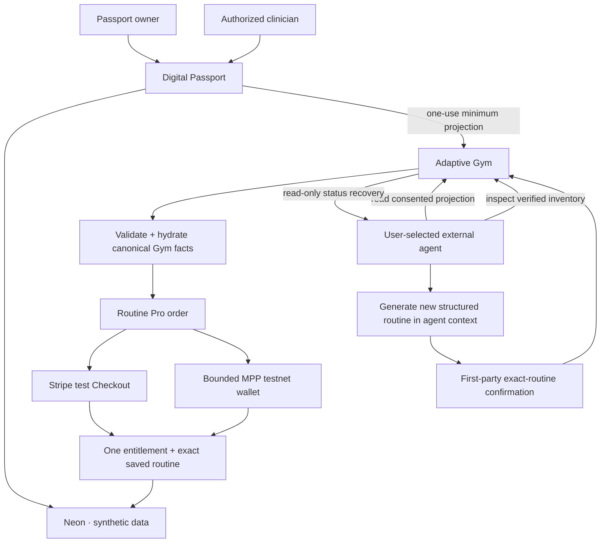

# Adaptive World architecture

Status: implementation contract for the synthetic WebMCP hackathon MVP.

## Product and deployment boundary

One monorepo produces two independently deployed, human-first applications:

| Vercel project            | Root            | Audience                                     | Responsibility                                                                                                                                |
| ------------------------- | --------------- | -------------------------------------------- | --------------------------------------------------------------------------------------------------------------------------------------------- |
| `adaptive-world-passport` | `apps/passport` | Passport owner and authorized clinician      | Identity, consent, sources, grants, audit history, one-use Gym projection, and owner saved routines                                           |
| `adaptive-world-gym`      | `apps/gym`      | Public visitor and connected synthetic owner | Free verified discovery, temporary minimum context, untrusted-routine validation, Routine Pro sandbox payment, receipt recovery, and feedback |

They share typed contracts, security primitives, demo fixtures, and the same
environment's Neon database. They do not share browser cookies. Passport health
data never appears in a Gym URL, payment provider request, or provider metadata.
Neither application calls an AI model, installs a model SDK, or holds model API
credentials. The user-selected external WebMCP agent supplies the personalized
routine intelligence.

## Trust boundaries

1. Browser, WebMCP input, redirects, tool registrations, and submitted routines
   are untrusted.
2. Authentication proves a session identity; protected authorization is
   recomputed on every server invocation.
3. Tool presence expresses availability, not authority.
4. Manufacturer data, documents, user-authored text, and agent-authored exercise
   instructions are untrusted content.
5. Equipment IDs must exist and be available in the current Gym catalog.
   Canonical names, models, source links, and specifications are hydrated by Gym
   and never accepted from the agent.
6. Price, currency, payer/provider, entitlement, merchant, wallet, chain,
   destination, and patient identity are derived server-side.
7. Provider success requires verified webhook/credential/receipt evidence, not
   a redirect, URL, model statement, or browser flag.
8. Database/provider/wallet/capability credentials remain server-only.

## Context handoff

1. Passport prepares the exact allowlisted projection and a short-lived signed
   proof; the owner reviews those server-owned fields before approval.
2. The creation API requires that proof and rejects changed or expired
   preparations, so neither a human client nor WebMCP can bypass the review.
3. Passport creates a random 256-bit one-use code and stores only its digest.
4. The code expires in the requested 1–20 minute window and appears only in a
   URL fragment, which Gym removes immediately.
5. Gym atomically consumes the code and creates an anonymous persisted session.
6. Gym receives goals, preferences, capabilities, avoidances, stop signals,
   purpose, provenance class, and expiry—never identity or clinical sources.
7. Creation, redemption, denial, replay, expiry, and revocation generate
   redacted audit metadata.

## Free and Pro boundary

Free public APIs, semantic pages, and WebMCP tools expose the Gym profile and
verified equipment catalog. A Passport is optional for discovery. Connecting
and reading the minimum projection is free.

`adaptive_world.routine_pro.v1` is one Passport-linked entitlement. It permits
Gym to validate, purchase, and save the exact structured routine produced by
the user-selected external agent through `create_personalized_routine`. It does
not grant additional health scopes.

Every Routine Pro request carries one of two closed intents, discriminated by
`initiatedVia`:

- `webmcp`: the exact agent-generated routine (`routine`). Provenance marker
  `webmcp_agent_generated@1.0`; `generationMode: agent_generated`.
- `site-ui`: a published staff walkthrough (`templateId`) chosen by a person on
  the Gym site without an agent. Provenance is the walkthrough id and version;
  `generationMode: staff_template`. It is labeled as a staff walkthrough chosen
  on the Gym site and is never presented as agent-generated.

Both intents are grounded in the same active projection, staged on the bound
Gym session before any provider submission, confirmed exactly as shown, and
saved with the same validation, payment, and recovery machinery. An order is
reused only for the identical intent, channel, goal, and staged content.

The external agent must first inspect the active projection and relevant Gym
equipment, then generate a new routine in its own reasoning context. The
submitted goal and routine are shown together during confirmation. Gym enforces
closed schemas, duration and text bounds, current catalog availability, exact
goal matching, preserved Passport stop signals, no medical-clearance claims,
and mandatory professional review for injury, rehabilitation, or undocumented-
clearance scenarios.

The existing order records the active Gym session, exact confirmed goal, and
`webmcp_agent_generated` provenance marker. The validated plan is staged on that
bound server session before any provider submission. No predefined routine is
loaded from the marker.

## Confirmation and fulfillment

A consequential WebMCP mutation first performs a read-only server preparation.
The first-party UI displays the complete proposed routine, approved Passport
projection, canonical selected equipment, product, **$4.99 test USD** amount,
payer, sandbox network, Passport save destination, and professional-review
warning when applicable. Decline performs no write. After approval, the server
recomputes the quote and authority before creating or reusing one patient/product
order.

At most one payable order and one provider window/submitted attempt may exist
for a patient and product, across routes, sessions, and payer rails. Verified
payment grants at most one entitlement. Entitlement grant and exact staged
routine persistence occur in the same transaction, so a fulfilled result is
recoverable without another payment. If the staged plan no longer validates at
fulfillment time (for example a station became unavailable), the verified
payment still grants the entitlement, the deferral is audited, and status
reports `routineSaved: false` so the routine can be resubmitted without paying.

The read-only `get_routine_pro_status` tool returns bounded receipt and outcome
fields for the active session, including fulfilled orders. After any timeout or
ambiguous response, the caller must read status and poll only while the order is
non-terminal. It never returns secrets, keys, credentials, capabilities, raw
receipt headers, or provider request snapshots.

Payment initiation is guarded by durable 10-minute counters whose database keys
are HMAC hashes of the Gym session, public order, client IP, and—when
applicable—the fixed demo-agent subject. Raw dimension values are not persisted.

## Provider durability

### Stripe

Before the first Checkout create call, Gym persists the exact normalized
request, canonical bytes, fingerprint, idempotency key, requested expiry,
first-request time, and conservative replay-safe cutoff. Retry before the cutoff
uses the exact snapshot and key. An unattached retry at or after
`idempotency_replay_until` sends no create request and moves to reconciliation;
it cannot rotate the setup or payer rail without provider-definitive proof that
no Session was created.

### MPP

The server-held demo wallet reserves its daily budget atomically before any
external attempt. The order capability is an HMAC over the public order
reference, product key, amount minor, currency, capability version, and
immutable `capability_expires_at`, all persisted before the first challenge.
Submitted or ambiguous spend remains reserved until a definitive
provider/chain result. Reset never releases it merely because local time passed.

## Authorization posture and RLS

Application-level authorization is the required deployed boundary. Owner and
clinician reads resolve the current Better Auth session, application actor,
relationship, scope, expiry, and revocation for every invocation. Unauthorized
object IDs receive non-enumerating errors.

The repository includes PostgreSQL RLS policies as defense-in-depth design.
Runtime RLS is **not claimed as active** unless both Vercel applications use a
non-owner, non-`BYPASSRLS` role, set per-request identity within the same
transaction as protected queries, keep migrations on a separate owner
connection, and pass the complete preview regression suite. Partial activation
is not a release strategy.

## Data ownership and retention

| Data                                 | Canonical owner               | Gym/payment copy                                   | Retention rule                          |
| ------------------------------------ | ----------------------------- | -------------------------------------------------- | --------------------------------------- |
| Identity, contacts, clinical sources | Passport                      | Never                                              | Synthetic demo lifecycle                |
| Consent and clinician relationships  | Passport                      | Reference only                                     | Current state plus audit history        |
| Minimum Gym projection               | Passport-issued / Gym session | Allowlisted projection only                        | Expiry/revocation policy                |
| Equipment catalog                    | Gym                           | Public                                             | Product-data lifecycle                  |
| Agent-generated routine input        | User-selected external agent  | Validated, canonically hydrated staged/saved plan  | Synthetic demo lifecycle                |
| Order/setup/event/receipt digests    | Gym commerce service          | Provider-minimum metadata only                     | Preserve replay/reconciliation evidence |
| Entitlement and saved routine        | Passport owner                | Gym validates and saves; Passport reads owner-only | Synthetic demo lifecycle                |
| Budget ledger                        | Gym commerce service          | No browser/model copy                              | Preserve settled/submitted history      |
| Audit events                         | Shared database               | Redacted metadata only                             | Append-only demo evidence               |

Synthetic reset may restore user-visible demo state, but it must not erase
successful payment references, receipt digests, immutable provider snapshots,
settled budget, or unresolved submitted state.

## Runtime

- Next.js 16 App Router and Node.js route handlers.
- Better Auth server-side sessions.
- Neon/Drizzle persistence with versioned migrations.
- Strict Zod/JSON Schema at trust boundaries.
- Stripe test mode and MPP testnet only for the judged payment proof.
- Standard accessible UI remains authoritative when WebMCP is absent.
- No Vercel AI SDK, OpenAI API call, model credential, or server-side routine
  generation in Gym or Passport.

This MVP is not a clinical system, medical device, emergency service, payment
institution, money transmitter, custody product, or compliance certification.
