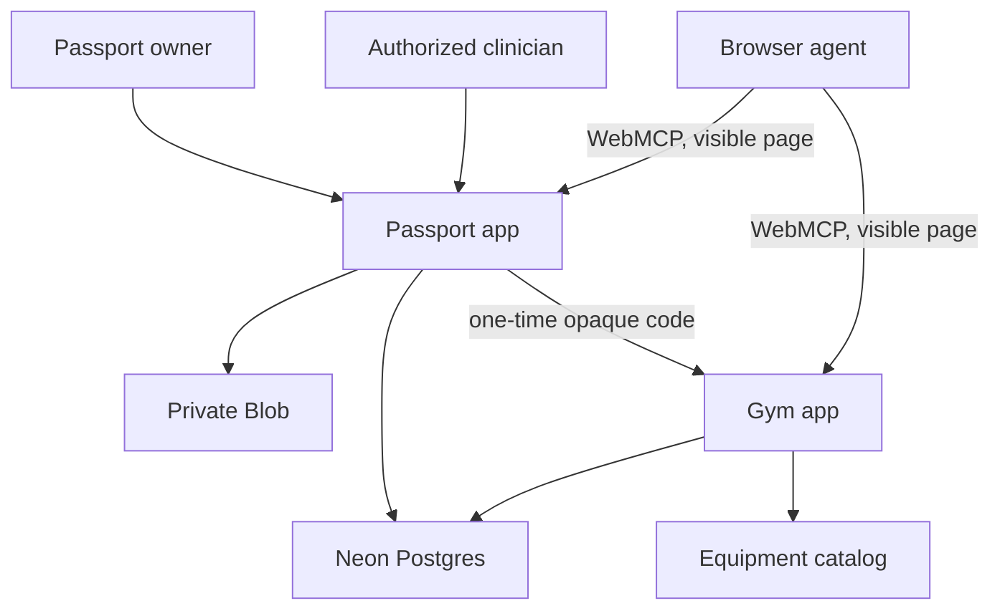

# Adaptive World architecture

Status: implementation baseline for the WebMCP hackathon MVP.

## Outcome

One monorepo produces two independently deployed, human-first web applications:

| Vercel project            | Root directory  | Audience                                | Responsibility                                                                              |
| ------------------------- | --------------- | --------------------------------------- | ------------------------------------------------------------------------------------------- |
| `adaptive-world-passport` | `apps/passport` | Passport owner and authorized clinician | Identity, consent, shares, sources, audit history, and one-time context grants              |
| `adaptive-world-gym`      | `apps/gym`      | Gym visitor                             | Product discovery, temporary minimum context, published walkthrough selection, and feedback |

The applications share contracts, authorization primitives, UI, demo fixtures, and database access through `packages/*`. They do not share browser cookies or place health context in URLs.

## System boundaries

### Trust boundaries

1. The browser is untrusted input. WebMCP tool arguments receive the same validation and authorization as public HTTP requests.
2. Authentication proves a session identity; authorization is evaluated again for every data access and mutation.
3. Passport and Gym are separate origins and Vercel projects. A context grant is the only approved bridge.
4. Documents and manufacturer content are untrusted payloads. Their text never becomes authority or policy.
5. Database and Blob credentials remain server-only. No secret uses a `NEXT_PUBLIC_` prefix.

## Context-grant protocol

1. An authenticated owner selects **Use in Adaptive Gym** and reviews the minimum projection.
2. Passport creates a random 256-bit code. Only a keyed digest or hash of the code is persisted.
3. The code is returned once, expires within five minutes, and is sent to Gym without any health data in the URL.
4. Gym redeems the code server-to-server. Redemption is atomic and single-use.
5. Gym stores only the projected fields, their purpose, provenance, expiry, and revocation reference.
6. Creation, redemption, denial, expiry, and revocation produce append-only audit events.

The share's lifetime and the redemption code's lifetime are different. A code can expire in five minutes while the resulting projection remains valid for the user-approved session window.

## Authorization invariants

- A clinician can enumerate only patients who granted that clinician an active relationship.
- Knowing a patient, document, share, or grant identifier confers no access.
- Scope checks occur at the repository/service layer, not only in UI or WebMCP registration.
- Gym never receives names, birth dates, contacts, medications, raw labs, source documents, or clinician identity.
- Mutating tools require an explicit review step and an idempotency key.
- Every denial is safe to repeat and does not reveal whether an unauthorized resource exists.

## Authentication and actor separation

- Better Auth owns password verification and server-side sessions in its own tables.
- The application maps the authenticated subject to a server-stored role; role is never accepted from the browser.
- Passport owners and doctors use distinct navigation and route boundaries. There is no role switch or patient-profile picker.
- The doctor can enumerate only active relationships and then only sections covered by the associated grant.
- Gym is a separate origin with no Passport cookie. After one-use redemption it receives only a signed, anonymous Gym session cookie.

## WebMCP posture

WebMCP is progressive enhancement for the page a person is visiting. Standard controls and APIs remain complete without it. The imperative API is the default for authenticated and state-dependent tools; declarative tools are appropriate only for simple visible forms.

Tool registration follows route, role, and state. A tool is unregistered as soon as the user leaves the route or loses the required state. The browser registry is a discoverability surface, never an authorization boundary.

See [WEBMCP_TOOLS.md](./WEBMCP_TOOLS.md) and [THREAT_MODEL.md](./THREAT_MODEL.md).

## Data ownership

| Data                                | Canonical owner         | Gym copy allowed?   | Retention                          |
| ----------------------------------- | ----------------------- | ------------------- | ---------------------------------- |
| Identity and contact                | Passport                | No                  | Until demo reset/account deletion  |
| Clinical documents and observations | Passport/private Blob   | No                  | Synthetic demo only                |
| Consent and clinician relationships | Passport                | Reference only      | Until revoked plus audit record    |
| Minimum gym projection              | Passport                | Yes                 | Until projection expiry/revocation |
| Equipment catalog                   | Gym                     | Yes                 | Product data lifecycle             |
| Session draft and feedback          | Gym                     | Yes                 | Demo lifecycle                     |
| Audit events                        | Shared security service | Event metadata only | Append-only demo history           |

## Runtime and persistence

- Next.js 16 App Router; Route Handlers are treated as public endpoints.
- Node.js runtime by default for authentication, database, cryptography, and Blob access.
- Neon pooled connection string for request traffic; direct connection only for migrations.
- Private Vercel Blob for synthetic source documents.
- Zod/JSON Schema at trust boundaries; Drizzle migrations are the database history.

This MVP uses synthetic data and is not a clinical system, medical device, emergency service, or claim of HIPAA compliance.
