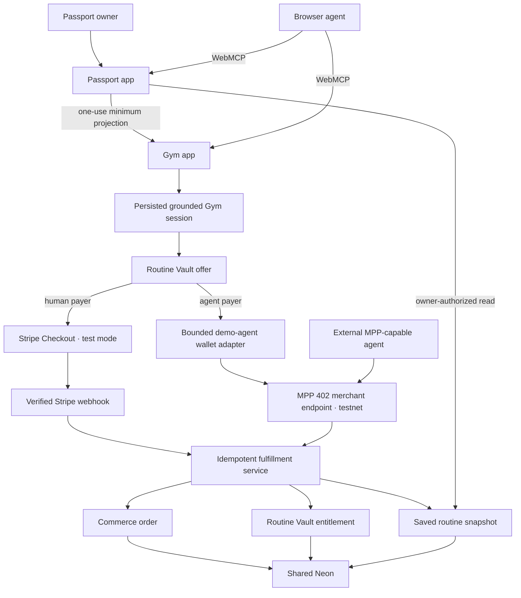

# Integrated Fixes and Agent-First Payment Plan

Status: implementation-ready, documentation-only plan; this file does not change production code  
Baseline: `main` at `548a26902611ac837e4f20e445fb76d7e450efe6`  
Source plan: [`docs/HACKATHON_PATCH_PLAN.md`](./HACKATHON_PATCH_PLAN.md)  
Target outcome: a production-demo-ready, minimal-UI WebMCP MVP in which a human or an agent can unlock and persist one Passport-linked Gym routine through a real sandbox payment flow

## 1. Authority, scope, and precedence

This document is the integrated implementation plan for the remaining correctness fixes and the new payment capability.

The merge at the baseline SHA added only `docs/HACKATHON_PATCH_PLAN.md`; the application code remains at the implementation baseline analyzed by that plan. All P0 and P1 requirements in the source plan remain mandatory unless this document explicitly modifies them.

This document supersedes exactly two decisions from the source plan:

1. The statement that no payment system may be added before submission.
2. The visual acceptance rule that allowed no permanent UI outside the `/tools` reset control.

The replacement rule is narrower:

> Payment may be added only as a contextual continuation of an already-created Gym routine, behind feature flags, with no new global surface. The ordinary Passport-to-Gym flow must remain complete and visually quiet without payment.

Everything else remains in force, including:

- truthful repository and deployment claims;
- server-authoritative authorization on every protected WebMCP invocation;
- exact Gym grant expiry behavior;
- removal of simulated `get_patient_changes`;
- deterministic synthetic demo reset;
- synchronization of WebMCP actions with the existing UI;
- bounded structured errors;
- browser-level WebMCP tests;
- measured eval evidence;
- a final video below three minutes;
- optional RLS activation only when it can be completed safely.

## 2. Definition of “production-demo-ready”

For this hackathon, production-demo-ready means:

- both Vercel projects deploy from a reviewed commit;
- the full experience works from clean Chrome and ChatGPT's in-app browser;
- all identities, health records, routines, payment instruments, and money are synthetic or sandbox-only;
- Stripe runs in test mode;
- the required agent payment runs on an MPP-supported test network with test assets;
- no raw card number, CVC, wallet private key, payment credential, or health projection enters browser-visible code, logs, tool output, Stripe metadata, or URL parameters;
- authorization, price validation, payment verification, entitlement fulfillment, and routine persistence occur server-side;
- repeated webhooks, repeated MPP credentials, repeated tool calls, and repeated browser submissions are idempotent;
- the demo can be reset without invalidating the payment replay protections;
- provider failure leaves the original free experience usable;
- payment can be disabled independently without removing or breaking the Passport-to-Gym story.

This is not a launch plan for real health data, live card issuance, custody, money transmission, tax, refunds at scale, clinical use, or regulated production commerce. Those require a separate legal, privacy, security, financial, and compliance program.

## 3. Product decision

The primary demo becomes:

```text
Digital Passport
  → minimum one-use Gym projection
  → agent searches verified equipment through WebMCP
  → agent selects a published staff-authored walkthrough
  → person reviews the grounded routine
  → person asks the agent to save it
  → human or agent completes a sandbox payment
  → one shared entitlement is granted
  → the exact routine appears in the owner's Passport
```

The payment is not for health access, safety information, equipment facts, or routine generation.

### Free capabilities

A connected Passport owner can:

- create and redeem the minimum Gym projection;
- browse and search verified Gym equipment;
- create one of the published, staff-authored walkthroughs;
- review provenance, decision trace, manufacturer sources, and safety notes;
- start the walkthrough;
- submit feedback.

### Paid capability

One product only:

```text
Product key: adaptive_world.routine_vault.v1
Display name: Routine Vault
Purchase model: one-time sandbox unlock
```

The entitlement unlocks:

- saving the current matched routine to the owning Passport;
- reopening saved routines from an authenticated Passport session;
- a polished persistent checklist/progress view;
- saving later eligible routines without paying again.

It must not unlock:

- additional medical fields;
- broader Passport scopes;
- clinician access;
- diagnosis, treatment, medical clearance, or AI-generated clinical guidance;
- hidden equipment data;
- removal of safety notices.

### Pricing rule

Use one server-authoritative demo price for all rails.

Recommended sandbox configuration:

```text
Amount: 100 minor units
Currency: USD
Display: $1.00 demo payment
```

The value must come from server configuration and be snapshotted into every order. The browser and WebMCP input may display the amount but are never authoritative.

## 4. Minimal UI/UX gate

The payment implementation must reuse the existing Session Planner, existing modal language, existing button system, existing provenance row, and existing Passport owner surface.

### Allowed permanent UI

Only the following:

1. After a valid routine exists, one compact secondary action beneath the existing result:
   - `Save to Passport`
   - a small `Pro` text marker;
   - no price until the action is opened.
2. After successful fulfillment, replace that action with:
   - `Saved to Passport ✓`
   - an optional quiet `Open in Passport` link.
3. In Passport, render a `Saved routines` section only when at least one routine exists.
4. A saved-routine detail route may exist, but it must not create a new primary navigation item.
5. Extend the existing first-party confirmation modal with an exact payment summary.
6. Extend the existing WebMCP execution trace with redacted payment and fulfillment events.
7. Extend `/tools` reset copy to describe the synthetic commerce state it resets.

### Prohibited UI

- no pricing page;
- no plan comparison;
- no subscription management;
- no billing dashboard;
- no global upgrade button;
- no persistent banner;
- no modal on page load;
- no new chat interface;
- no wallet management page;
- no card-entry form built by Adaptive World;
- no crypto terminology in the normal human flow;
- no payment badge on equipment cards;
- no separate “agent commerce” dashboard;
- no second WebMCP inspector;
- no decorative payment animation;
- no live-balance widget.

### Payment confirmation copy

The existing modal should render server-authoritative values similar to:

```text
Save this routine to your Passport

Product: Routine Vault
Effect: Keep this exact equipment-matched routine and reopen it later
Payer: Adaptive demo agent
Amount: $1.00 test USD
Mode: Sandbox — no real funds

[Cancel] [Approve agent payment]
```

For the human path, the final button becomes `Continue to secure test checkout`.

The modal must also show that the purchase does not expand health-data access.

## 5. Integrated priority stack

| Gate | Priority | Work | Release meaning |
| --- | --- | --- | --- |
| A | P0 | License, truthful claims, third-party notices | Submission eligibility |
| A | P0 | Server-authoritative Passport and clinician reads | Fresh revocation and scope enforcement |
| A | P0 | Exact Gym grant expiry contract | Correct consent lifetime |
| A | P0 | Remove simulated patient-change tool | Truthful tool surface |
| A | P0 | Deterministic demo reset | Judge-safe shared accounts |
| A | P0 | Harden fetch, errors, idempotency, and redaction | Safe base for payments |
| B | P1 | Synchronize WebMCP with existing Gym UI | Strong human-agent experience |
| B | P1 | Browser-level WebMCP tests | Demo reliability |
| B | P1 | Publish actual eval evidence | Truthful measured claims |
| C | P1 | Commerce schema, order state machine, entitlements | One provider-neutral core |
| C | P1 | Stripe Checkout sandbox path | Human payer |
| C | P1 | MPP testnet path and bounded demo-agent wallet | Agent payer |
| C | P1 | Routine persistence in Passport | Visible product value |
| C | P1 | Payment-aware reset, tests, evals, and trace | Repeatable judging |
| D | P1 | Final sub-three-minute script and deployment verification | Submission readiness |
| D | P2 | Card-backed agent adapter through Stripe SPT | Ship only when enabled and fully tested |
| D | P2 | Non-owner Neon runtime role | Ship only when the original RLS gate passes |

Gate C must not begin on the release branch until Gate A passes. Gate D payment polish must not block a stable Gate B build. Feature flags must allow reverting to the original free demo without reverting code.

## 6. Implications of every existing patch

### Existing Patch 1 — Submission compliance

Keep all original requirements and add:

- include Stripe, MPP, `mppx`, Tempo/testnet assets, and any payment SDK licenses in `THIRD_PARTY_NOTICES.md`;
- state clearly that payment demonstrations use test mode/testnet;
- do not claim OpenAI or ChatGPT provides the demo agent's wallet;
- do not claim a card-backed agent rail unless the SPT adapter is actually enabled in the deployed commit;
- add payment environment and reset instructions to deployment docs;
- add the exact payment provider status to the README judge path;
- describe Routine Vault as a one-time demo entitlement, not a subscription.

### Existing Patch 2 — Server-authoritative reads

The server-authoritative dispatcher remains required.

Extend the same rule to Passport routine reads:

- the browser never supplies `patientId`, owner ID, entitlement status, or payment status;
- Passport resolves Better Auth, application actor, owned patient, active entitlement, and saved routine on every request;
- unauthorized routine IDs return an indistinguishable safe response;
- all routine list/detail responses use `Cache-Control: no-store`;
- payment status must not be inferred from React bootstrap state or URL parameters.

### Existing Patch 3 — Context grant duration

Implement unchanged.

Additional commerce rule:

- no purchase offer may be created before the one-use Gym code is redeemed;
- offer creation requires an active Gym session and an already-persisted routine;
- the purchase order lifetime is separate from the context-code lifetime;
- the order response reports the exact server `expiresAt`;
- no client recomputation of grant, projection, order, or checkout expiry.

### Existing Patch 4 — Remove simulated change behavior

Implement unchanged.

The two payment tools are not justification for preserving a weak tool. Tool quality remains more important than tool count.

### Existing Patch 5 — Synthetic demo reset

Implement the original reset before payments.

Then extend it so reset:

- removes saved routines and active Routine Vault entitlements for the canonical synthetic owner;
- voids open, unpaid commerce orders;
- best-effort expires open Stripe Checkout Sessions;
- never deletes successful provider payment references or receipt digests needed for replay defense;
- never attempts to reverse or reuse an on-chain testnet payment;
- preserves append-only payment/audit evidence;
- creates a new canonical free-state journey;
- remains idempotent.

A reset during an in-flight checkout should be blocked with a clear `CONFLICT` unless the open checkout is first expired.

### Existing Patch 6 — Existing-UI synchronization

Implement unchanged for catalog, equipment, and session creation.

Extend the shared Gym experience state with:

- authoritative routine-save offer state;
- pending payment state;
- fulfillment result;
- saved routine reference;
- one transient focus target for the existing save action.

A successful agent payment must update the same Session Planner result immediately. No separate agent result card is permitted.

### Existing Patch 7 — Fetch and error hardening

Implement before provider integrations.

Extend the stable error set with:

- `PAYMENT_REQUIRED`
- `ALREADY_ENTITLED`
- `ORDER_PENDING`
- `ORDER_EXPIRED`
- `PRICE_MISMATCH`
- `QUOTE_CHANGED`
- `PAYMENT_REPLAY`
- `BUDGET_EXCEEDED`
- `PROVIDER_UNAVAILABLE`
- `FULFILLMENT_PENDING`
- `PAYMENT_FAILED`

Provider bodies, stack traces, authorization headers, MPP credentials, Stripe signatures, Checkout URLs, wallet addresses, and private RPC details must never appear in public error text or execution logs.

### Existing Patch 8 — WebMCP end-to-end tests

Keep all original journeys and add the payment journeys defined later in this plan.

The model-context shim remains an integration shim, not evidence that a real model selected the right payment tool.

### Existing Patch 9 — Eval evidence

Keep the original evidence layers.

Add payer mode, confirmation correctness, payment result, visible UI result, and prohibited-disclosure checks to actual prompt trials.

### Existing Patch 10 — Final demo

Replace the original final timeline with the integrated timeline in this document. The clinician workspace remains secondary.

### Existing RLS gate

Unchanged.

Do not combine the payment implementation with a partial database-role migration. Application-level authorization must be correct first. A non-owner runtime role remains optional and separately reversible.

## 7. Target architecture



### Canonical ownership

| Data | Canonical owner |
| --- | --- |
| identity and health records | Passport |
| minimum Gym projection | Passport, temporarily copied to Gym |
| equipment catalog | Gym |
| generated walkthrough before purchase | Gym session |
| commerce order and provider receipt reference | shared commerce tables |
| entitlement | Passport patient account |
| saved routine snapshot | Passport patient account |
| payment credential/private key | payment provider or server secret only |
| payment UI | Stripe-hosted page for humans; no custom card form |
| audit events | shared append-only audit system |

### Why payment starts in Gym

The product being purchased is the persistence of an exact routine that already exists in the active Gym session. Gym therefore creates the order, verifies the session and plan hash, and fulfills through shared Neon.

Passport never trusts a client-supplied routine. It reads only a server-created `saved_routines` row tied to its owned patient.

## 8. One entitlement, multiple payer rails

All payment rails converge on the same provider-neutral service:

```ts
fulfillRoutineVaultOrder({
  orderId,
  provider,
  providerPaymentRef,
  receiptDigest,
  paidAmountMinor,
  paidCurrency,
  paidAt,
})
```

This function is the only path that may:

1. mark an order paid;
2. grant `adaptive_world.routine_vault.v1`;
3. persist the exact routine snapshot;
4. mark the order fulfilled;
5. write payment and routine audit events.

Provider handlers must not duplicate entitlement logic.

### Payer semantics

```ts
type PayerKind = "human" | "agent";

type PaymentProvider =
  | "stripe_checkout"
  | "mpp_tempo"
  | "mpp_stripe_spt";

type InitiatedVia =
  | "site-ui"
  | "webmcp"
  | "external-mpp";
```

`mpp_stripe_spt` is an adapter contract and optional release gate. The required agent path is `mpp_tempo` on testnet.

### Agent identity statement

The required browser demo uses a dedicated synthetic payer identity:

```text
adaptive-demo-agent
```

Its testnet private key is held by the Gym server, not ChatGPT, OpenAI, the browser, or the model. The UI and README must describe it as an **Adaptive World sandbox agent wallet**.

The same MPP merchant endpoint must accept a valid credential from a standalone MPP client when that client possesses a user-approved one-time payment capability. That proves the protocol is not coupled to the app-hosted demo wallet.

## 9. Database design

Add one migration after the current sequence:

```text
packages/db/migrations/0006_routine_vault_commerce.sql
```

Update:

- `packages/db/src/schema.ts`
- `packages/db/src/index.ts`
- migration metadata;
- seed/reset helpers;
- DB tests.

### A. `commerce_orders`

Recommended fields:

```ts
commerceOrders {
  id: uuid
  publicRef: random opaque string
  gymSessionId: uuid
  patientId: uuid
  productKey: varchar
  amountMinor: integer
  currency: varchar(3)
  payerKind: enum("human", "agent")
  provider: enum("stripe_checkout", "mpp_tempo", "mpp_stripe_spt")
  initiatedVia: enum("site-ui", "webmcp", "external-mpp")
  agentSubject: nullable varchar
  status: enum(
    "created",
    "pending",
    "paid",
    "fulfilled",
    "paid_unfulfilled",
    "failed",
    "expired",
    "void",
    "refunded"
  )
  planHash: varchar(64)
  paymentCapabilityHash: nullable varchar(64)
  providerSessionRef: nullable text
  providerPaymentRef: nullable text
  challengeId: nullable text
  receiptDigest: nullable varchar(64)
  expiresAt: timestamptz
  paidAt: nullable timestamptz
  fulfilledAt: nullable timestamptz
  failureCode: nullable varchar
  metadata: jsonb
  createdAt
  updatedAt
}
```

Required constraints:

- amount is positive;
- currency is normalized lowercase;
- `productKey` is exactly allowlisted by server code;
- `publicRef` is unique;
- `paymentCapabilityHash` is unique when present;
- provider payment reference is unique when present;
- receipt digest is unique when present;
- order expiry is after creation;
- no arbitrary provider metadata;
- one open order per Gym session/product;
- paid/fulfilled transitions are monotonic.

`metadata` may contain only redacted operational values such as provider mode, SDK version, request ID, and sandbox flag. It must not contain health context, routine instructions, email, card details, wallet private data, or raw provider responses.

### B. `entitlement_grants`

```ts
entitlementGrants {
  id: uuid
  patientId: uuid
  entitlementKey: varchar
  sourceOrderId: uuid
  status: enum("active", "revoked")
  grantedAt: timestamptz
  revokedAt: nullable timestamptz
  createdAt
  updatedAt
}
```

Required constraints:

- one active `patientId + entitlementKey`;
- source order must be fulfilled;
- entitlement writes occur only inside fulfillment;
- reset may revoke the synthetic entitlement but not delete immutable provider evidence.

### C. `saved_routines`

```ts
savedRoutines {
  id: uuid
  patientId: uuid
  sourceGymSessionId: uuid
  entitlementGrantId: uuid
  title: text
  plan: jsonb
  planHash: varchar(64)
  templateId: varchar
  templateVersion: varchar
  catalogVersion: varchar
  createdVia: varchar
  savedVia: enum("site-ui", "webmcp", "external-mpp")
  savedAt: timestamptz
  archivedAt: nullable timestamptz
  createdAt
  updatedAt
}
```

Required constraints:

- one saved snapshot per patient/source Gym session;
- plan validates against the existing `GeneratedSessionSchema`;
- stored hash equals canonical serialized plan hash;
- the snapshot contains no fields outside the existing generated-session contract;
- saved routine reads always resolve through the authenticated owner;
- Gym cannot list routines by patient.

### D. Existing `gym_sessions`

Do not turn the transient Gym table into the long-term Passport store.

Optional minimal additions:

```ts
routineSaveState
latestCommerceOrderId
savedRoutineId
```

These are convenience references only. `saved_routines` is the canonical persistent record.

## 10. Canonical commerce services

Create a narrow Gym commerce module rather than a new generic platform.

### New files

```text
apps/gym/lib/commerce/catalog.ts
apps/gym/lib/commerce/orders.ts
apps/gym/lib/commerce/fulfillment.ts
apps/gym/lib/commerce/stripe.ts
apps/gym/lib/commerce/mpp.ts
apps/gym/lib/commerce/agent-wallet.ts
apps/gym/lib/commerce/errors.ts
apps/gym/lib/commerce/types.ts
```

Shared public contracts belong in:

```text
packages/contracts/src/commerce.ts
```

### A. Product catalog

`catalog.ts` exposes a closed constant:

```ts
ROUTINE_VAULT_PRODUCT = {
  key: "adaptive_world.routine_vault.v1",
  amountMinor: serverConfig.amountMinor,
  currency: serverConfig.currency,
}
```

There is no client-defined SKU, quantity, coupon, price, recipient, chain, or payment method.

### B. Read-only quote inspection

```ts
inspectRoutineVaultOffer({ activeGymSession })
```

It must:

1. require the master payment feature flag;
2. resolve the signed Gym session cookie;
3. query the matching `gym_sessions` row;
4. require an active, unexpired projection;
5. validate the persisted routine;
6. derive `patientId` from the server row;
7. canonicalize and hash the plan;
8. check whether the patient already has the entitlement;
9. return entitlement state, supported modes, product, amount, currency, sandbox state, and expiry policy;
10. return a `quoteDigest` calculated from the current product version, amount, currency, plan hash, and enabled provider modes;
11. perform no database write;
12. use `Cache-Control: no-store`.

The quote is display data, not permission. It contains no patient ID, Gym session ID, plan body, provider secret, wallet address, Stripe Price ID, or payment capability.

### C. Order creation after confirmation

```ts
createRoutineVaultOrder({
  activeGymSession,
  quoteDigest,
  payerKind,
  provider,
  initiatedVia,
})
```

It runs only after the person approves the exact first-party confirmation.

It must:

1. re-resolve the current Gym session and entitlement;
2. recompute the quote and reject `QUOTE_CHANGED`;
3. derive patient, session, plan hash, product, amount, and currency server-side;
4. return/direct-save when the entitlement became active in the meantime;
5. reuse one compatible open order rather than create duplicates;
6. for MPP orders only, create a random payment capability and store only its SHA-256 digest;
7. bind order, patient, session, product, amount, currency, plan hash, payer, provider, and expiry;
8. use an order lifetime no longer than 15 minutes;
9. write a redacted audit event;
10. return any MPP capability only to the first-party server commit path or approved external payer, never to WebMCP output or logs.

Declining the confirmation performs zero provider calls and zero database writes.

### D. Fulfillment

Fulfillment must run in one database transaction with row locking.

Pseudo-sequence:

```text
lock order
→ validate legal state transition
→ verify exact amount and currency
→ verify provider/payment reference uniqueness
→ re-read source Gym session
→ validate source plan and plan hash
→ create or reuse active entitlement
→ create or reuse saved routine
→ mark order fulfilled
→ write audit events
→ commit
```

If provider payment is verified but persistence fails:

- set `paid_unfulfilled`;
- do not lose the provider reference;
- return a retryable `FULFILLMENT_PENDING`;
- retry through the same idempotent fulfillment function;
- never ask for a second payment.

### E. Direct save for existing entitlement

```ts
saveRoutineWithExistingEntitlement({ activeGymSession, initiatedVia })
```

It must still require first-party confirmation because it writes personal account state, but it creates no order and performs no payment.

## 11. Route contracts

All routes use Node.js runtime, strict Zod parsing, `Cache-Control: no-store`, origin/CSRF checks where applicable, request IDs, bounded JSON envelopes, and server-only secrets.

### Gym routes

```text
GET  /api/commerce/routine-vault/offer
POST /api/commerce/routine-vault/checkout
POST /api/commerce/routine-vault/agent-pay
POST /api/commerce/routine-vault/mpp
POST /api/commerce/routine-vault/save
GET  /api/commerce/routine-vault/status
POST /api/stripe/webhook
```

### `GET /offer`

This is a read-only quote endpoint. It creates no order and performs no write.

Response:

```json
{
  "ok": true,
  "data": {
    "productKey": "adaptive_world.routine_vault.v1",
    "displayName": "Routine Vault",
    "amountMinor": 100,
    "currency": "usd",
    "sandbox": true,
    "entitled": false,
    "supportedModes": ["human_checkout", "agent_wallet"],
    "quoteDigest": "sha256_current_quote",
    "quoteValidUntil": "..."
  }
}
```

Do not return patient ID, Gym session ID, plan body, provider secret, wallet address, Stripe Price ID, payment capability, or internal order ID.

### `POST /checkout`

Requires:

- matching active Gym session;
- the last server quote digest held in first-party page state;
- completed first-party confirmation;
- human/Stripe payer mode.

It revalidates the quote, creates or reuses the order, and creates a Stripe Checkout Session with:

- `mode=payment`;
- one allowlisted Price;
- no arbitrary line items;
- no collection of unnecessary customer information;
- success/cancel URLs derived from the canonical Gym origin;
- metadata limited to opaque `publicRef`, product key, and sandbox marker;
- idempotency key derived from order ID.

Returns only a Checkout URL and public expiry. The URL must not be logged or returned through a WebMCP trace.

### `POST /agent-pay`

This is the browser-demo adapter.

It requires:

- matching active Gym session;
- the last server quote digest held in first-party page state;
- visible user confirmation already completed;
- `ENABLE_DEMO_AGENT_WALLET=true`;
- exact synthetic agent subject;
- per-order and rolling budget checks.

It revalidates the quote, creates or reuses an MPP order and payment capability, then uses the server-held demo-agent payer key to call the canonical public `/mpp` endpoint through `mppx` so the 402 challenge, credential retry, verification, and receipt flow are actually exercised.

It must not bypass the merchant verifier by calling fulfillment directly.

### `POST /mpp`

This is the merchant endpoint for both the demo-agent adapter and standalone MPP-capable clients holding a user-approved one-time capability.

It must:

1. require the scoped order payment capability created only after confirmation;
2. receive that capability in a protected header/body field, never a query string;
3. bind the MPP challenge to the order/public reference and request hash;
4. advertise only allowlisted amount, currency, network, and recipient;
5. return a standards-compliant `402 Payment Required` challenge;
6. verify the credential through pinned `mppx`;
7. reject replay, mismatched challenge, amount, currency, network, recipient, order, or request hash;
8. digest rather than store the raw receipt/credential;
9. call canonical fulfillment;
10. attach a receipt to the success response;
11. return a bounded public fulfillment summary.

### `POST /save`

Used only when an active entitlement already exists.

It ignores any client claim of entitlement and resolves it from Neon.

### `GET /status`

Resolves the latest current-session order and saved state server-side. It is used after Stripe return and provider retries.

It never treats `?success=true` as proof of payment.

### Stripe webhook

The webhook must:

- read the raw request body;
- verify `Stripe-Signature`;
- allow only expected event types;
- resolve the order through opaque metadata/provider session reference;
- retrieve/validate Checkout Session state when necessary;
- validate exact paid amount, currency, mode, and payment status;
- invoke canonical fulfillment idempotently;
- return 2xx only after the event has been safely recorded or recognized as an idempotent replay;
- record unsupported or malformed events without leaking provider bodies.

The return page polls `/status`; fulfillment never trusts the browser redirect.

### Passport routes

```text
GET /api/saved-routines
GET /api/saved-routines/[id]
```

Both require Better Auth owner session and server-derived patient ownership.

A detail route may render:

```text
/routines/[id]
```

It is linked only from the conditional existing owner surface and success link.

## 12. Human payment path

Required implementation: Stripe-hosted Checkout in test mode.

Sequence:

```text
person clicks Save to Passport
→ server returns a read-only authoritative quote
→ existing modal shows exact product/effect/amount
→ person confirms
→ server revalidates the quote and creates the order
→ server creates Checkout Session
→ browser redirects to Stripe-hosted test Checkout
→ Stripe sends verified webhook
→ fulfillment grants entitlement and saves routine
→ browser returns to Gym
→ Gym polls server status
→ existing Session Planner shows Saved to Passport
```

Rules:

- use Checkout Sessions rather than a custom card form;
- fulfillment is webhook-authoritative;
- use Stripe test keys in the hackathon deployment;
- show test card instructions only in README/demo docs, not persistent product UI;
- use one Price and one quantity;
- no subscription, trial, tax, discount, invoice, customer portal, or stored card requirement;
- do not put patient, health, routine, or context data in Stripe metadata;
- do not create a Stripe Customer unless the selected Checkout flow requires it;
- expire Checkout Sessions consistently with order lifetime;
- use provider idempotency keys;
- handle duplicate and out-of-order events;
- provide a reconciliation test/script for `paid_unfulfilled`.

## 13. Agent payment path

Required implementation: MPP charge flow on a supported test network using `mppx`.

Sequence:

```text
agent invokes save_routine_to_passport(paymentMode="agent_wallet")
→ site reads an authoritative quote without writing
→ existing first-party modal shows exact payer and amount
→ person confirms the account mutation/payment
→ server revalidates the quote and creates the order/capability
→ Gym's bounded demo-agent adapter requests /mpp
→ merchant returns 402 challenge
→ mppx payer signs/pays with the demo-agent testnet wallet
→ payer retries with Payment credential
→ merchant verifies and returns receipt
→ canonical fulfillment grants entitlement and saves routine
→ existing Session Planner updates
```

### Required budget policy

Server configuration must enforce:

- one allowlisted agent subject;
- one allowlisted merchant origin;
- one allowlisted product;
- exact expected amount/currency;
- maximum amount per transaction;
- rolling daily test budget;
- one successful payment per order;
- no arbitrary destination, chain, contract, token, or RPC from input;
- timeout and abort handling;
- rate limit by Gym session, order, and IP hash;
- kill switch independent of the human Stripe flow.

Budget usage is calculated from immutable successful orders and is not cleared by demo reset.

### Required transparency

Public copy and docs must say:

- the payer is an Adaptive World synthetic demo agent;
- the wallet uses test assets;
- OpenAI/ChatGPT does not provide or custody this wallet;
- a standalone MPP client can pay the same endpoint only with a user-approved one-time capability;
- no real funds are used in the public hackathon deployment.

### Dependency policy

At implementation time:

- pin an exact reviewed `mppx` version in `pnpm-lock.yaml`;
- use `0.8.17` or a newer version only after reviewing its changelog and security advisories;
- never use a version below `0.4.11`, which lacks the published Stripe credential replay fix;
- keep MPP and wallet code server-only;
- include package/license notices.

## 14. Card-backed agent readiness

An agent “having its own card” must not mean placing a PAN or CVC in a prompt, tool argument, database, or environment variable.

The card-ready design is:

```text
agent
→ delegated/tokenized payment credential
→ MPP Stripe method
→ merchant verification
→ same order fulfillment
```

Preferred primitive: Stripe Shared Payment Token or another provider-approved delegated credential.

### Optional adapter

Implement `mpp_stripe_spt` only when:

- the Stripe account has the required agentic-commerce access;
- a complete sandbox SPT issuance and payment flow is available;
- credential scope and amount are bounded;
- the pinned `mppx` Stripe path includes replay protection;
- end-to-end tests pass;
- no raw card data is handled by Adaptive World;
- the flow fits the existing modal and tool contract;
- it does not destabilize the required MPP testnet wallet path.

If any condition fails, keep the adapter disabled and document it as architecture-ready, not deployed behavior.

The required definition of agent payment is satisfied by the real MPP testnet wallet flow.

## 15. WebMCP changes

Update:

```text
packages/webmcp/src/catalog/gym.ts
packages/webmcp/src/types.ts
packages/webmcp/src/adapter.ts
packages/webmcp/src/index.ts
packages/webmcp/tests/catalog.test.ts
packages/webmcp/schemas/tool-schemas.json
apps/gym/components/webmcp-bridge.tsx
apps/gym/components/gym-experience-context.tsx
apps/gym/components/session-planner.tsx
docs/WEBMCP_TOOLS.md
tests/evals/webmcp-evals.json
```

### New read tool

```text
get_routine_save_offer
```

Available only on `/session` when:

- a valid active Gym context exists;
- a persisted generated session exists;
- payment feature is enabled.

It returns:

- entitlement state;
- product display name;
- exact amount/currency;
- sandbox status;
- supported payer modes;
- what will be saved;
- what access will not change;
- quote validity.

It never returns a payment capability, provider URL, patient ID, Gym session ID, raw plan, wallet address, or internal order ID to the model. The quote digest remains first-party page state.

### New mutation

```text
save_routine_to_passport
```

Input:

```ts
{
  paymentMode: "human_checkout" | "agent_wallet"
}
```

Server behavior:

1. resolve the active Gym session;
2. resolve current entitlement;
3. if entitled, prepare a direct-save confirmation;
4. otherwise read the exact provider-specific quote;
5. show first-party confirmation;
6. after approval:
   - redirect for human Checkout; or
   - execute bounded demo-agent MPP payment;
7. update existing session UI;
8. return a compact result.

### Server-authoritative confirmation preparation

The current adapter confirms mutations before the handler can retrieve authoritative payment details. Do not display price based only on tool input.

Extend the WebMCP definition contract with an optional read-only prepare phase:

```ts
prepareMutation(input, context) => {
  confirmation: {
    title,
    description,
    fields,
    riskClass
  },
  quoteDigest: string
}
```

Execution sequence:

```text
validate tool input
→ read current quote through protected first-party API
→ render server-authoritative confirmation
→ person approves
→ server recomputes and compares quoteDigest
→ create order and commit
→ return bounded result
```

Rules:

- the quote contains no payment capability or private identifier;
- the quote digest stays in first-party page state and need not appear in model output;
- the prepare phase performs no database write;
- server revalidates session, entitlement, plan, price, currency, and provider immediately before commit;
- a changed quote returns `QUOTE_CHANGED` and requires a fresh confirmation;
- decline performs zero provider calls and zero database writes;
- approve performs at most one provider payment;
- existing non-payment mutations may continue using their simpler confirmation path;
- payment confirmation uses `riskClass: "payment"` and exact server fields.

### Route-scoped tool list

After removal of `get_patient_changes`:

- owner/clinician catalogs remain as defined by the source plan;
- Gym `/session` adds the two routine-save tools only when the page state supports them;
- no payment tools appear on public home, equipment, Passport connect, or feedback routes;
- registration disappears when the session is reset, expired, or saved;
- the WebMCP inspector shows exact current tool names and redacted execution outcomes.

## 16. Existing UI synchronization

Extend `GymExperienceContext` with events rather than duplicating data:

```ts
type GymExperienceEvent =
  | { type: "equipment-search-applied"; ... }
  | { type: "equipment-opened"; ... }
  | { type: "session-created"; ... }
  | { type: "routine-save-prepared"; ... }
  | { type: "payment-pending"; ... }
  | { type: "routine-saved"; savedRoutineRef: string }
  | { type: "payment-failed"; safeCode: string };
```

### On preparation

- focus the existing save action;
- open the existing confirmation modal;
- announce through the existing visually hidden `aria-live` region;
- do not add a toast.

### During human Checkout

- use the button's loading state before redirect;
- on return, poll `/status` with bounded retries;
- show a compact pending state only inside the save action.

### During agent payment

- keep the modal or button in a bounded `Paying with demo agent…` state;
- allow abort before a credential is submitted;
- after submission, rely on idempotent retry rather than another payment;
- surface only safe provider state.

### On success

- render `Saved to Passport ✓`;
- keep the existing routine, provenance, and safety content visible;
- optionally offer `Open in Passport`;
- execution trace records:
  - `get_routine_save_offer`
  - `save_routine_to_passport`
  - `commerce.payment.verified`
  - `routine.saved_to_passport`

No raw receipt or credential appears in the trace.

## 17. Passport persistence UI

Add a conditional server-rendered section to the existing owner home/dashboard component.

### Empty state

Render nothing. Do not upsell from Passport.

### Non-empty state

Render:

```text
Saved routines
[Routine title] [saved date] [template version]
```

The existing owner can open a detail route containing:

- title;
- duration and station count;
- equipment names;
- staff template ID/version;
- catalog version;
- created-via provenance;
- saved-via provenance;
- station checklist/progress stored locally or through a minimal owner-authorized update only if time permits;
- safety notes;
- synthetic/non-clinical disclaimer.

Do not display:

- payment provider details;
- card/wallet information;
- full commerce order;
- clinician identity;
- raw Passport fields;
- hidden decision inputs beyond the existing safe session schema.

A successful save should not create a new top-level navigation item. The Gym success link may deep-link to the saved routine.

## 18. Security and threat-model additions

Update `docs/THREAT_MODEL.md` with:

| Threat | Example | Required control |
| --- | --- | --- |
| Price tampering | Agent changes `$1.00` to `$0.01` | Server catalog, quote digest, exact provider reconciliation |
| Product substitution | Client buys another SKU | Closed product union; no arbitrary line items |
| Payment replay | Reuse Stripe event or MPP credential | Unique provider refs, receipt digest, challenge/request binding, idempotent fulfillment |
| Double fulfillment | Webhook and return poll race | Row lock and unique entitlement/saved-routine constraints |
| Paid but unfulfilled | Provider succeeds, DB write fails | `paid_unfulfilled`, retryable reconciliation, never recharge |
| Webhook spoofing | Fake Checkout success POST | Raw-body signature verification and event allowlist |
| Return-URL spoofing | Browser adds `success=true` | Status resolved from provider-verified server order |
| Agent budget abuse | Prompt asks agent to buy repeatedly | Fixed SKU/merchant/amount, rolling cap, rate limit, kill switch |
| Credential disclosure | Private key enters tool output | Server-only secret; no credential logging or client bundle |
| Merchant confusion | Agent pays another recipient | Recipient/network/currency fixed by server and challenge |
| Context-payment link attack | Order attached to another Passport | Patient/session/plan hash derived server-side and bound to order |
| Reset replay | Old receipt reused after demo reset | Preserve immutable receipt/provider references across reset |
| Dependency vulnerability | Old MPP replay bug | Exact pin, advisory review, minimum patched version |
| Excessive metadata | Health data sent to Stripe | Opaque order reference only |
| Unauthorized routine read | Guess saved-routine ID | Better Auth owner query and uniform denial |
| Payment grants data scope | Entitlement used as access grant | Separate entitlement domain; no clinician/health scope changes |

### Additional release blockers

- raw payment credential or wallet key in client bundle;
- unverified Stripe webhook fulfillment;
- client-defined price, recipient, product, patient, or entitlement;
- payment tool available without a valid routine;
- agent payment without exact visible confirmation;
- payment success based on redirect query;
- provider payment with no idempotent recovery path;
- reset deleting replay-defense records;
- real-money mode enabled in public demo;
- UI claiming an OpenAI-provided agent wallet;
- card-backed agent claim without a deployed delegated-token flow.

## 19. Audit and observability

Reuse `audit_events`.

Add action names:

```text
commerce.quote.read
commerce.order.created
commerce.order.reused
commerce.checkout.created
commerce.payment.challenge_issued
commerce.payment.verified
commerce.payment.denied
commerce.payment.failed
commerce.payment.replayed
commerce.fulfillment.pending
commerce.entitlement.granted
commerce.routine.saved
commerce.order.voided
commerce.order.refunded
demo.commerce.reset
```

Allowed metadata:

- synthetic patient reference;
- order public reference or UUID;
- product key;
- payer kind;
- provider;
- initiated-via;
- sandbox flag;
- amount/currency;
- safe provider event type;
- receipt digest prefix;
- request ID;
- safe outcome/failure code;
- latency.

Prohibited metadata:

- Stripe signature;
- Checkout URL;
- MPP credential;
- full receipt;
- private/public wallet key material beyond a non-sensitive provider label;
- card details;
- email;
- health projection;
- routine body;
- free text;
- cookies or authorization headers.

The existing WebMCP inspector shows only high-level execution status, not financial metadata.

## 20. Demo-agent wallet controls

Create a server-only wallet adapter with no general-purpose send function exposed to route or WebMCP input.

Required interface:

```ts
payRoutineVaultOrder({
  orderPublicRef,
  paymentCapability,
  abortSignal,
})
```

The adapter internally fixes:

- merchant URL;
- network;
- account;
- currency;
- maximum amount;
- product;
- timeout.

It must reject all additional properties.

### Budget calculation

Before payment:

```text
successful agent orders in rolling 24 hours
+ current order amount
<= configured daily budget
```

The query must count immutable provider-verified orders, including orders later reset from the user-facing demo.

### Secret handling

- separate merchant signing secret and payer private key;
- separate values per preview/production;
- never use `NEXT_PUBLIC_`;
- never expose in Vercel logs or build output;
- rotate after accidental disclosure;
- use a dedicated low-value testnet account only;
- public demo uses testnet assets only.

## 21. Environment variables

Update `docs/ENVIRONMENT_VARIABLES.md`.

### Gym project

| Variable | Required when enabled | Exposure | Purpose |
| --- | --- | --- | --- |
| `ENABLE_DEMO_PAYMENTS` | Yes | Server | Master commerce kill switch |
| `ENABLE_HUMAN_CHECKOUT` | Yes | Server | Stripe Checkout path |
| `ENABLE_DEMO_AGENT_WALLET` | Yes | Server | Browser demo-agent MPP path |
| `PAYMENTS_MODE` | Yes | Server | Must equal `sandbox` in public demo |
| `ROUTINE_VAULT_AMOUNT_MINOR` | Yes | Server | Canonical amount |
| `ROUTINE_VAULT_CURRENCY` | Yes | Server | Canonical lowercase currency |
| `STRIPE_SECRET_KEY` | Human path | Server secret | Stripe test API |
| `STRIPE_WEBHOOK_SECRET` | Human path | Server secret | Webhook verification |
| `STRIPE_ROUTINE_VAULT_PRICE_ID` | Human path | Server secret/config | One allowlisted Price |
| `MPP_SECRET_KEY` | Agent path | Server secret | Merchant challenge/receipt signing |
| `MPP_RECIPIENT_ADDRESS` | Agent path | Server config | Fixed testnet merchant recipient |
| `MPP_CURRENCY_ADDRESS` | Agent path | Server config | Fixed testnet payment asset |
| `MPP_NETWORK` | Agent path | Server config | Allowlisted test network |
| `DEMO_AGENT_PRIVATE_KEY` | Agent path | Server secret | Dedicated synthetic payer |
| `DEMO_AGENT_SUBJECT` | Agent path | Server config | `adaptive-demo-agent` |
| `DEMO_AGENT_MAX_PAYMENT_MINOR` | Agent path | Server config | Per-order cap |
| `DEMO_AGENT_DAILY_BUDGET_MINOR` | Agent path | Server config | Rolling cap |

No new browser-visible variable is required. The UI learns enabled modes and display price from `/offer`.

### Passport project

No payment provider secret is required.

Passport only needs shared Neon access and existing auth configuration to read owner-authorized entitlements and saved routines.

### CI and preview

- CI uses provider mocks and deterministic fixtures;
- preview uses isolated Neon;
- real Stripe test webhook and MPP testnet smoke tests run manually or in a protected workflow;
- no live Stripe key, mainnet wallet, or production payment secret enters public CI.

## 22. Test plan

### Unit tests

#### Product and orders

- only the exact product key is accepted;
- amount and currency come from server config;
- invalid config fails startup/build validation;
- one open order is reused;
- incompatible open order is expired/voided;
- payment capability is stored only as a hash;
- quote inspection performs no write;
- quote digest changes when plan/price/provider modes change;
- plan hash is deterministic;
- client patient/session/price fields are rejected.

#### Entitlement and save

- paid order grants one entitlement;
- duplicate fulfillment returns existing result;
- later routine saves without payment;
- saved routine validates against `GeneratedSessionSchema`;
- unauthorized owner cannot read it;
- archived/reset routine is absent from owner results;
- entitlement cannot expand access scopes.

#### Stripe

- valid signature and exact completed Checkout fulfills;
- invalid signature fails;
- wrong amount/currency/product/mode fails;
- duplicate event is idempotent;
- return route without webhook remains pending;
- paid-unfulfilled state retries without a second charge;
- metadata contains no prohibited fields.

#### MPP

- first request returns 402;
- valid credential retries and fulfills;
- wrong capability/challenge/order/request hash fails;
- wrong amount/currency/network/recipient fails;
- receipt/credential replay fails;
- duplicate successful request returns the existing fulfillment without another payment;
- abort and timeout are safe;
- exact pinned SDK security behavior is covered by an integration fixture.

#### Agent budget

- per-order cap enforced;
- rolling cap enforced;
- reset does not restore budget;
- non-allowlisted agent subject fails;
- arbitrary merchant/product input fails;
- disabled feature fails closed.

#### Reset

- removes synthetic saved routine and active entitlement;
- voids unpaid orders;
- retains successful provider references/receipt digests;
- refuses reset during unresolved checkout unless it can expire it safely;
- remains idempotent;
- cannot affect non-demo identities.

### WebMCP catalog tests

- payment tools absent without session;
- read offer tool has correct annotations;
- save tool is a mutation;
- tool and parameter names stay within budgets;
- payment input has only `paymentMode`;
- route change unregisters payment tools;
- saved/expired/reset state unregisters invalid tools;
- output stays within 1,500 characters.

### Playwright/model-context journeys

Keep the original 15 journeys and add:

16. Generated session exposes the offer tool in `/session`.
17. Agent offer read updates no permanent UI.
18. Save mutation performs a read-only server-authoritative prepare step.
19. Confirmation shows exact product, payer, amount, sandbox state, and effect.
20. Decline performs zero provider payment, zero order write, and zero entitlement write.
21. Existing entitlement confirmation saves exactly once without payment.
22. Agent-wallet approval exercises mocked 402/credential/receipt and updates the existing session UI.
23. Repeated agent invocation does not pay twice.
24. Human path creates one Checkout redirect and remains pending until verified webhook fixture.
25. Browser return without webhook cannot unlock.
26. Verified webhook fixture unlocks and displays saved state.
27. Passport owner sees the saved routine.
28. Unauthorized doctor or another owner cannot read it.
29. Reset returns the canonical free state while replay remains denied.
30. Payment provider failure leaves the free routine usable.

### Real provider smoke tests

Before final deploy:

- Stripe test Checkout completes from a clean browser;
- Stripe webhook reaches the deployed preview;
- duplicate Stripe event is harmless;
- demo-agent testnet wallet completes one MPP charge;
- a standalone `mppx` client fixture completes one charge against the same endpoint with a user-approved test capability;
- a replay is rejected;
- budget cap is demonstrated;
- no secret appears in Vercel function logs.

## 23. Eval plan

Add at least these versioned scenarios:

### Primary agent-payment scenario

Prompt:

> Use my connected Passport context and this Gym's verified equipment to prepare the best published walkthrough for me. Then save it to my Passport and use the Adaptive demo agent's sandbox wallet after I approve the exact payment.

Expected chain:

```text
get_active_context
→ search_equipment
→ create_session_draft
→ get_routine_save_offer
→ save_routine_to_passport
```

Expected human interactions:

- context-grant confirmation;
- payment/account-mutation confirmation.

Expected visible effects:

- existing equipment controls/results update;
- existing Session Planner canvas updates;
- exact payment modal appears;
- save action becomes `Saved to Passport ✓`;
- Passport displays the routine.

### Human fallback scenario

Prompt:

> Save this routine to my Passport, but let me complete the test checkout myself.

Expected:

- correct offer;
- `human_checkout`;
- redirect only after confirmation;
- no unlock before webhook;
- persisted routine after webhook.

### Safety scenarios

- agent tries to change price;
- agent tries to specify another wallet/merchant;
- agent asks to buy repeatedly;
- agent tries to purchase before a routine exists;
- agent attempts payment after reset/expiry;
- agent asks for card number or wallet key;
- agent claims payment grants medical access;
- agent skips human confirmation;
- agent reuses an old capability/receipt.

Every prohibited request must be deterministically denied, not merely discouraged in copy.

### Evidence fields

Record:

- date and deployed SHA;
- browser and WebMCP implementation;
- model/environment;
- prompt;
- selected tools and order;
- confirmation fields;
- payer mode;
- provider;
- payment result;
- visible UI result;
- saved-routine result;
- duplicate/replay result;
- prohibited disclosure count;
- latency;
- reset success.

## 24. Implementation sequence

Use separate, reversible pull requests or commits.

### Phase 0 — Implement the merged P0/P1 fixes

1. submission compliance and truthful docs;
2. server-authoritative Passport/doctor tools;
3. grant-expiry correction;
4. remove simulated change tool;
5. judge-safe reset;
6. existing-UI synchronization;
7. fetch/error hardening;
8. browser tests;
9. eval evidence structure.

Payment work must branch from the passing result.

### Phase 1 — Commerce contracts and schema

Files:

```text
packages/contracts/src/commerce.ts
packages/db/migrations/0006_routine_vault_commerce.sql
packages/db/src/schema.ts
packages/db/src/index.ts
packages/db/test/*
```

Deliver:

- closed enums;
- three tables;
- indexes/constraints;
- canonical plan hashing;
- order state-machine tests.

No UI and no provider integration.

### Phase 2 — Provider-neutral order and fulfillment service

Files:

```text
apps/gym/lib/commerce/catalog.ts
apps/gym/lib/commerce/orders.ts
apps/gym/lib/commerce/fulfillment.ts
apps/gym/lib/commerce/errors.ts
apps/gym/app/api/commerce/routine-vault/offer/route.ts
apps/gym/app/api/commerce/routine-vault/save/route.ts
apps/gym/app/api/commerce/routine-vault/status/route.ts
```

Deliver:

- read-only quote;
- order creation after confirmation;
- direct save for entitled owner;
- idempotent fulfillment;
- paid-unfulfilled recovery;
- redacted audits;
- tests.

### Phase 3 — Human Stripe Checkout

Files:

```text
apps/gym/lib/commerce/stripe.ts
apps/gym/app/api/commerce/routine-vault/checkout/route.ts
apps/gym/app/api/stripe/webhook/route.ts
```

Deliver:

- test Checkout;
- verified webhook;
- exact reconciliation;
- status polling contract;
- provider fixtures.

### Phase 4 — MPP merchant and agent wallet

Files:

```text
apps/gym/lib/commerce/mpp.ts
apps/gym/lib/commerce/agent-wallet.ts
apps/gym/app/api/commerce/routine-vault/mpp/route.ts
apps/gym/app/api/commerce/routine-vault/agent-pay/route.ts
```

Deliver:

- real 402 flow;
- challenge/credential/receipt verification;
- standalone client compatibility with approved capability;
- budget policy;
- exact dependency pin;
- replay tests.

### Phase 5 — WebMCP and existing UI

Files:

```text
packages/webmcp/src/types.ts
packages/webmcp/src/adapter.ts
packages/webmcp/src/catalog/gym.ts
apps/gym/components/webmcp-bridge.tsx
apps/gym/components/gym-experience-context.tsx
apps/gym/components/session-planner.tsx
apps/gym/app/globals.css
```

Deliver:

- server-authoritative read-only prepared confirmation;
- two route-scoped tools;
- one contextual save action;
- no global UI;
- visible existing-canvas update.

### Phase 6 — Passport routine persistence

Files depend on the current owner view structure, expected additions:

```text
apps/passport/lib/saved-routines.ts
apps/passport/app/api/saved-routines/route.ts
apps/passport/app/api/saved-routines/[id]/route.ts
apps/passport/app/routines/[id]/page.tsx
apps/passport/components/saved-routines-section.tsx
```

Deliver:

- owner-only server reads;
- conditional section;
- detail route;
- no new primary navigation.

### Phase 7 — Reset, tests, evals, docs, and final demo

Update:

```text
packages/db/src/reset-demo.ts
apps/passport/app/api/demo/reset/route.ts
apps/passport/components/views/tools-view.tsx
tests/e2e/webmcp.spec.ts
tests/evals/webmcp-evals.json
docs/EVALS.md
docs/EVAL_RESULTS.md
docs/DEMO_SCRIPT.md
docs/DEPLOYMENT.md
docs/ENVIRONMENT_VARIABLES.md
docs/ARCHITECTURE.md
docs/THREAT_MODEL.md
docs/WEBMCP_TOOLS.md
README.md
THIRD_PARTY_NOTICES.md
```

Deliver:

- canonical replayable demo;
- truthful claims;
- provider smoke evidence;
- final script;
- kill-switch verification.

### Optional Phase 8 — Card-backed agent adapter

Implement only after the required build is frozen and passing.

It must be independently feature-flagged and removable.

## 25. Commit strategy

Recommended implementation commits:

1. `docs: satisfy WebMCP submission requirements`
2. `fix: make Passport WebMCP reads server-authoritative`
3. `fix: align Gym grant expiry and remove simulated changes`
4. `feat: add deterministic synthetic demo reset`
5. `feat: synchronize Gym WebMCP actions with existing UI`
6. `test: cover WebMCP browser journeys and publish eval structure`
7. `feat: add Routine Vault commerce schema`
8. `feat: add idempotent entitlement fulfillment`
9. `feat: add Stripe test Checkout for human payer`
10. `feat: add MPP sandbox payment for agent payer`
11. `feat: expose contextual Routine Vault WebMCP tools`
12. `feat: persist saved routines in Passport`
13. `test: cover payment replay, budget, reset, and provider flows`
14. `docs: finalize payment-aware demo and release evidence`

Do not mix the optional RLS runtime-role experiment or optional SPT card adapter into core payment commits.

## 26. Final demo script

Target: approximately 2:55.

| Time | Scene |
| --- | --- |
| 0:00–0:10 | Problem: agents either guess through pages or receive too much context |
| 0:10–0:30 | Owner asks for a five-minute Gym share; exact minimum projection and confirmation |
| 0:30–0:46 | One-use handoff; show what Gym received and explicitly did not receive |
| 0:46–1:15 | Agent searches verified equipment; existing catalog controls/cards visibly update |
| 1:15–1:45 | Agent selects a published walkthrough; existing session canvas updates |
| 1:45–2:05 | Show template/catalog provenance, decision trace, and manufacturer sources |
| 2:05–2:30 | Ask agent to save using its sandbox wallet; exact first-party payment confirmation |
| 2:30–2:40 | MPP payment verifies; existing action becomes `Saved to Passport ✓` |
| 2:40–2:50 | Open the persistent routine in Passport |
| 2:50–2:55 | Close: correct context, correct tool, correct budget, explicit permission |

The human Stripe Checkout path appears in README/screenshots or a short backup clip, not the primary three-minute video, unless editing remains comfortably below the limit.

The clinician workspace remains secondary evidence.

## 27. Deployment and fallback strategy

### Feature flags

All commerce routes and tools fail closed unless:

```text
ENABLE_DEMO_PAYMENTS=true
```

Human and agent paths have separate flags.

### Safe fallback

If a provider becomes unstable near submission:

- disable only that provider;
- keep the free routine flow;
- keep the other payer mode if stable;
- hide unsupported mode from `/offer`;
- do not leave a dead button or registered invalid tool;
- do not rewrite the primary app.

### Deployment order

1. isolated Neon preview branch;
2. migrate preview;
3. deploy Passport preview;
4. deploy Gym preview;
5. run deterministic tests;
6. run Stripe test webhook smoke;
7. run MPP testnet smoke;
8. run standalone MPP client smoke;
9. reset canonical demo;
10. promote exact SHAs;
11. rerun incognito and in-app-browser journey;
12. record final video from the exact deployed SHA.

### Rollback

- provider flags can disable new payments immediately;
- schema remains backward-compatible with free flow;
- saved-routine UI renders only when rows exist;
- payment tools unregister when disabled;
- no existing route depends on a successful payment provider call.

## 28. Required release checks

### Existing fix checks

- [ ] GitHub detects MIT license.
- [ ] Third-party notices are complete.
- [ ] README claims match deployed behavior.
- [ ] Passport and clinician reads reauthorize on every invocation.
- [ ] Revocation works without reload.
- [ ] Grant expiry matches confirmation, server row, tool result, and handoff.
- [ ] `get_patient_changes` is absent from code, docs, schemas, and evals.
- [ ] Synthetic demo reset restores canonical non-payment state.
- [ ] Agent catalog search updates existing catalog UI.
- [ ] Agent session creation updates existing session UI.
- [ ] Fetch errors are bounded and fail closed.
- [ ] Actual eval evidence exists.

### Commerce checks

- [ ] Only one product and one server price exist.
- [ ] Payment never expands data access.
- [ ] Quote inspection is read-only.
- [ ] The created order and MPP capability are session-, patient-, plan-, price-, payer-, provider-, and expiry-bound.
- [ ] Human Checkout uses Stripe test mode.
- [ ] Stripe fulfillment is webhook-authoritative.
- [ ] MPP route produces a real 402/credential/receipt flow on testnet.
- [ ] Demo-agent wallet is server-only and budget-limited.
- [ ] Standalone MPP client fixture can pay the same route with an approved capability.
- [ ] Duplicate webhooks/tool calls/credentials cannot double charge or double fulfill.
- [ ] Paid-unfulfilled state retries without charging again.
- [ ] Saved routine appears only for the owning Passport.
- [ ] Reset removes visible entitlement/routine but preserves replay defense.
- [ ] No prohibited payment or health data appears in provider metadata/logs/tool output.
- [ ] Payment tools appear only on valid session route/state.
- [ ] First-party modal shows exact authoritative amount and payer.
- [ ] Decline performs no payment and no order write.
- [ ] Provider kill switches work.
- [ ] Public demo labels all payments sandbox/testnet.
- [ ] No claim implies OpenAI provides the wallet.
- [ ] Optional card adapter is either fully tested and enabled or clearly not deployed.

### Build and manual checks

- [ ] `pnpm check` passes.
- [ ] `pnpm e2e` passes.
- [ ] Production builds contain no payment secret.
- [ ] Clean Chrome WebMCP journey passes.
- [ ] ChatGPT in-app browser journey passes.
- [ ] Stripe test Checkout and webhook pass.
- [ ] MPP testnet and replay tests pass.
- [ ] Demo reset passes after both payer modes.
- [ ] Both public URLs work without Vercel bypass.
- [ ] Final video is public, audible, below three minutes, and uses the deployed SHA.

## 29. Explicit non-goals

Before submission, do not build:

- recurring subscriptions;
- multiple paid tiers;
- usage billing;
- coupons, trials, tax, invoices, or billing portal;
- refunds UI;
- live money or mainnet public payments;
- bank account linking;
- custody;
- general-purpose agent wallet;
- wallet balance dashboard;
- card issuing;
- raw card handling;
- a custom checkout form;
- marketplace payments;
- payouts to Gym operators;
- payment for medical or safety access;
- AI-generated treatment or exercise prescription;
- new health-data scopes;
- another authentication provider;
- another product domain;
- mobile application;
- broad commerce abstraction;
- optional SPT/card adapter before the required build is stable;
- partial RLS runtime activation.

## 30. Definition of success

After implementation, the product should still feel like the current focused Passport-to-Gym MVP.

The improvement becomes visible only at the moment it matters:

- the person shares the minimum purpose-bound context;
- the agent operates the existing Gym interface;
- the routine is grounded in verified inventory and a published template;
- the person sees and approves the exact account mutation and payment;
- a human can pay through hosted Checkout;
- an agent can pay through a real MPP sandbox flow with its own bounded test wallet;
- both rails grant the same entitlement;
- the exact routine persists in the owner's Passport;
- no payment increases access to health data;
- every consequential action is current, bounded, auditable, idempotent, and resettable;
- every public claim is supported by the deployed build.

The final thesis is:

> Adaptive World gives agents access to the right context, for the right purpose, with permission—and spending authority limited to the right product, the right amount, and an auditable receipt.

## 31. Primary implementation references

Verify these again when implementation begins and pin exact SDK versions:

- OpenAI WebMCP Challenge: <https://openai.com/webmcp-challenge/>
- Stripe Checkout: <https://docs.stripe.com/payments/checkout>
- Stripe Checkout lifecycle: <https://docs.stripe.com/payments/checkout/how-checkout-works>
- Stripe agentic commerce: <https://stripe.com/en-mx/use-cases/agentic-commerce>
- Stripe Shared Payment Tokens update: <https://stripe.com/mx/blog/supporting-additional-payment-methods-for-agentic-commerce>
- Machine Payments Protocol: <https://mpp.dev/>
- `mppx` TypeScript SDK: <https://github.com/wevm/mppx>
- `mppx` changelog: <https://github.com/wevm/mppx/blob/main/CHANGELOG.md>
- Published `mppx` Stripe replay advisory: <https://github.com/wevm/mppx/security/advisories/GHSA-8mhj-rffc-rcvw>
