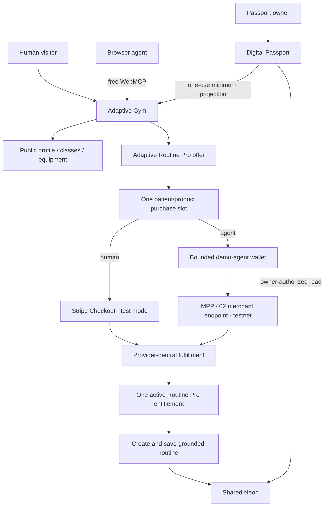

# Integrated Fixes, Free WebMCP, and Agent-First Pro Plan

Status: implementation-ready, documentation-only plan; this file does not change production code  
Baseline: pull request #2 branch `docs/fixes-and-payment-plan`, incorporating review feedback through commit `183898e6228d78a5dc0d8779e26c0ef1faef7f32`  
Source plan: [`docs/HACKATHON_PATCH_PLAN.md`](./HACKATHON_PATCH_PLAN.md)  
Target outcome: a production-demo-ready Adaptive World MVP with a free public Gym WebMCP layer and one low-cost Pro entitlement shared by the human UI and agent workflows

## 1. Authority and product decision

This document integrates the original hackathon correction plan with the final free-versus-Pro product boundary and the payment design. All P0 and P1 requirements in `HACKATHON_PATCH_PLAN.md` remain mandatory unless this document explicitly narrows or replaces them.

Adaptive Gym exposes two complementary layers through the same website and protected server services:

1. **Free public Gym intelligence** — available without payment to ordinary visitors, accessible browsers, and WebMCP-capable agents.
2. **Adaptive Routine Pro** — one Passport-linked entitlement that unlocks personalized routine creation and persistence through either the existing human UI or a route-scoped WebMCP mutation.

WebMCP is progressive enhancement, not the only access path. Every public fact must also remain available through semantic HTML, keyboard- and screen-reader-accessible UI, and bounded first-party server responses.

The primary product story is:

```text
free public Gym discovery
  → optional minimum Passport connection
  → request personalization
  → exact low-cost Pro offer
  → human or bounded demo agent pays in sandbox
  → one shared Passport entitlement
  → personalized routine appears in the existing Gym UI
  → routine is saved to the owner’s Passport
```

The clinician workspace remains a secondary authorization proof and must not compete with this primary demo.

## 2. Free and Pro boundaries

### 2.1 Free public access

No payment or Passport is required to:

- read the Gym profile, services, hours, rules, accessibility summary, and any real staff-authored activity/class summary;
- search the verified equipment catalog;
- open equipment details and manufacturer provenance;
- use the same information through the ordinary accessible UI;
- use public Gym WebMCP tools when the browser exposes WebMCP;
- view a clearly labeled generic sample walkthrough that is not personalized to a Passport;
- understand what Adaptive Routine Pro unlocks and what data it does not receive.

Connecting a Passport and inspecting the exact minimum Gym projection also remains free.

Required free WebMCP tools:

```text
get_gym_profile
search_equipment
get_equipment
get_active_context        // only after an optional Passport handoff
get_routine_pro_offer     // only after active context; read-only
```

`get_gym_profile` may include a bounded class/activity summary only when the repository has a visible, staff-authored source of truth. Do not invent classes or add tools merely to increase tool count.

### 2.2 Adaptive Routine Pro

One product only:

```text
Entitlement key: adaptive_world.routine_pro.v1
Display name: Adaptive Routine Pro
Purchase model: one-time Passport unlock
Reference price: USD $4.99
Sandbox amount: 499 minor units in Stripe test mode and the configured MPP test-asset equivalent
```

The price is intentionally low enough to resemble a plausible consumer add-on while still communicating real product value. There is no pricing page, plan comparison, subscription, recurring billing, coupon, or trial in the MVP.

The entitlement unlocks the same capabilities for humans and agents:

- create a personalized routine from the active minimum Passport projection;
- ground every station in verified Gym equipment and a published staff-authored template;
- create through the existing Session Planner UI;
- create through a route-scoped WebMCP mutation;
- persist the routine to the owning Passport;
- reopen it in a compact checklist/progress view;
- create later eligible routines without paying again.

Payment never unlocks:

- broader Passport scopes;
- names, medications, raw labs, documents, diagnosis narratives, or clinician identity;
- clinician access;
- hidden equipment facts;
- removal of safety information;
- diagnosis, treatment, clearance, or AI-generated clinical advice.

### 2.3 Premium tool contract

Use one premium mutation:

```text
create_personalized_routine
```

Input:

```ts
{
  templateId:
    | "first_visit_foundations"
    | "low_impact_orientation"
    | "accessible_equipment_tour";
  paymentMode?: "human_checkout" | "agent_wallet";
}
```

Behavior:

- Existing Pro entitlement: prepare a normal account-write confirmation and create/save without payment.
- No entitlement: `paymentMode` is required and the application prepares an exact server-authoritative payment confirmation.
- Human mode: create or resume Stripe Checkout only after approval.
- Agent mode: invoke the bounded Adaptive World demo-agent wallet only after approval.
- After fulfillment: retry routine creation idempotently and save automatically.
- Paid-but-failed generation: keep the entitlement active and allow generation retry without another payment.

Replace or refactor the current free `create_session_draft` path behind this contract. Do not leave a second free personalized-generation path in the human UI, HTTP routes, or WebMCP catalog.

## 3. Minimal UI/UX gate

The ordinary visitor should see essentially the same Gym. Payment appears only after the person requests personalization.

Allowed permanent UI:

- Keep all public profile, class/activity, and equipment surfaces free.
- Keep the existing template selector visible.
- Before entitlement, change the existing primary action to `Build my personalized routine` with one quiet `Pro` text marker.
- Open the existing first-party confirmation modal only after the action is requested.
- After success, populate the existing Session Planner canvas and show `Saved to Passport ✓` with an optional quiet `Open in Passport` link.
- In Passport, render `Saved routines` only when at least one exists.
- Keep the synthetic reset action only inside `/tools`.

Prohibited UI:

- no pricing or comparison page;
- no global upgrade button or persistent banner;
- no billing, subscription, wallet, or balance dashboard;
- no custom card-entry form;
- no crypto terminology in the ordinary human flow;
- no premium badge on every equipment/class card;
- no new chat widget;
- no duplicate agent-result surface;
- no second WebMCP inspector;
- no decorative payment animation.

Agent confirmation example:

```text
Create and save your personalized routine

Product: Adaptive Routine Pro
Includes: personalized routine creation and Passport saving
Payer: Adaptive World demo agent
Amount: $4.99 test USD
Mode: Sandbox — no real funds
Data access: unchanged; no additional health fields are shared

[Cancel] [Approve agent payment]
```

Human mode uses `Continue to secure test checkout` as the final action.

When a payment is already pending, the same action shows a compact `Payment already in progress` state with one `Resume` action. It must not open a second payer rail or create a second charge.

## 4. Existing hackathon fixes remain mandatory

Implement every P0 and P1 item in `HACKATHON_PATCH_PLAN.md` before payment work:

1. MIT licensing, third-party notices, truthful README claims, and a sub-three-minute judge path.
2. Server-authoritative Passport and clinician WebMCP reads on every invocation.
3. Identical Gym context-grant expiry in input, confirmation, persistence, and response.
4. Removal of the simulated `get_patient_changes` tool and replacement with live revocation enforcement.
5. Authenticated, synthetic-only, idempotent demo reset.
6. WebMCP synchronization with the existing Gym catalog, equipment route, and routine canvas.
7. Bounded fetch/error handling, abort support, redaction, and stable envelopes.
8. Playwright coverage with a deterministic `document.modelContext` shim.
9. Measured eval evidence rather than treating fixtures as completed model evaluations.
10. Optional non-owner Neon runtime role only behind the original all-or-nothing gate.

Payment work branches from a passing base:

```bash
pnpm check
pnpm e2e
```

## 5. Target architecture and hard invariants



Hard invariants:

- Public Gym understanding never requires payment.
- Payment purchases an account entitlement, not a specific pre-generated plan.
- At most one payable order exists for one `patientId + productKey`, regardless of template, payer, provider, route, or browser session.
- At most one provider payment window or submitted attempt is active for that payable order.
- Provider selection becomes immutable once an external payment window or credential submission exists.
- A second invocation resumes the existing order or returns `ORDER_PENDING`; it never opens another rail.
- The first verified payment may grant the entitlement; later verified payments are duplicate-payment reconciliation events, never second entitlements.
- Routine generation is separate, idempotent, and retryable after entitlement activation.
- Human confirmation is required before every payment or account write.
- Provider timestamps and provider-returned identifiers are authoritative for provider state; browser timestamps and redirect URLs are not.

## 6. Provider-neutral commerce services

All rails converge on:

```ts
fulfillRoutineProOrder({
  orderId,
  provider,
  providerPaymentRef,
  receiptDigest,
  paidAmountMinor,
  paidCurrency,
  paidAt,
})
```

Only this service may:

- validate the legal order transition;
- record a verified provider payment;
- grant or reuse `adaptive_world.routine_pro.v1`;
- settle an agent-budget reservation when applicable;
- classify duplicate successful payments;
- write redacted payment and entitlement audit events.

Routine generation remains separate:

```ts
createAndSavePersonalizedRoutine({
  activeGymSession,
  templateId,
  initiatedVia,
})
```

It must:

1. re-resolve the signed Gym session;
2. derive `patientId` from the server row;
3. require an active Pro entitlement;
4. validate current projection expiry/revocation;
5. use a published template and verified equipment only;
6. validate with `GeneratedSessionSchema`;
7. persist one owner-linked routine snapshot;
8. update the existing Gym canvas;
9. write a redacted audit event;
10. be safe to retry.

## 7. Data model

Add one migration after the current sequence, for example:

```text
packages/db/migrations/0006_adaptive_routine_pro.sql
```

### 7.1 `commerce_orders`

```ts
commerceOrders {
  id
  publicRef
  patientId
  originatingGymSessionId
  productKey
  payerKind                 // human | agent
  provider                  // nullable until committed; stripe_checkout | mpp_tempo
  initiatedVia              // site-ui | webmcp
  initialTemplateId         // informational only; not payment authority or uniqueness
  amountMinor
  currency
  status
  providerPaymentRef
  receiptDigest
  checkoutSessionId
  providerWindowCreatedAt
  paymentWindowExpiresAt
  capabilityVersion
  capabilityDigest
  budgetReservationId
  submittedAt
  paidAt
  fulfilledAt
  reconciledAt
  voidedAt
  failureCode
  duplicateOfOrderId
  refundReference
  createdAt
  updatedAt
}
```

Recommended status union:

```text
created
provider_pending
payment_submitted
reconciliation_required
paid_unfulfilled
fulfilled
failed
expired
voided
duplicate_paid
refund_pending
refunded
```

Required constraints:

- unique `publicRef`;
- unique non-null `provider + providerPaymentRef`;
- one active entitlement grant per `patientId + entitlementKey`;
- one **payable** order per `patientId + productKey` across every provider and template;
- provider, amount, currency, payer, and product are server-derived;
- `initialTemplateId` is never part of payment uniqueness and may change for generation after entitlement;
- `paymentWindowExpiresAt` is nullable until a provider window is successfully created and attached;
- no patient ID or health data enters provider metadata;
- one order may grant an entitlement at most once.

Use a partial unique index as defense in depth:

```sql
create unique index commerce_orders_one_payable_entitlement_idx
on commerce_orders (patient_id, product_key)
where status in (
  'created',
  'provider_pending',
  'payment_submitted',
  'reconciliation_required',
  'paid_unfulfilled'
);
```

Order creation must also lock the stable patient row so correctness does not depend only on handling a unique-constraint error.

### 7.2 `entitlement_grants`

```ts
entitlementGrants {
  id
  patientId
  entitlementKey
  sourceOrderId
  status                // active | revoked
  grantedAt
  revokedAt
  createdAt
  updatedAt
}
```

Constraint: one active `patientId + entitlementKey`.

### 7.3 `saved_routines`

```ts
savedRoutines {
  id
  patientId
  sourceGymSessionId
  entitlementGrantId
  title
  plan
  planHash
  templateId
  templateVersion
  catalogVersion
  createdVia
  savedAt
  archivedAt
  createdAt
  updatedAt
}
```

Constraints:

- one saved snapshot per patient/source-session/template result;
- plan validates against `GeneratedSessionSchema`;
- stored hash equals the canonical serialized plan hash;
- owner authorization is resolved server-side on every read;
- Gym cannot list routines by arbitrary patient ID.

### 7.4 `agent_budget_buckets`

```ts
agentBudgetBuckets {
  id
  agentSubject
  budgetDate
  currency
  limitMinor
  reservedMinor
  settledMinor
  updatedAt
}
```

Unique key: `agentSubject + budgetDate + currency`.

### 7.5 `agent_budget_reservations`

```ts
agentBudgetReservations {
  id
  bucketId
  orderId
  amountMinor
  status                // reserved | submitted | reconciliation_required | settled | released
  submittedAt
  settledAt
  releasedAt
  releaseReason
  lastReconciledAt
  createdAt
  updatedAt
}
```

Required constraints:

- unique `orderId` — one reservation ledger row per agent order;
- nonnegative bucket counters;
- reservation amount equals the immutable order amount;
- submitted/reconciliation-required reservations cannot be released merely because local time expired;
- reset cannot delete settled or unresolved submitted budget history.

The reservation row is the canonical ledger event. Bucket counters are maintained transactionally and periodically reconciled against reservation rows.

### 7.6 `payment_provider_events`

Use a small immutable provider-event table or equivalent durable ledger for webhook/receipt deduplication:

```ts
paymentProviderEvents {
  id
  provider
  providerEventId
  orderId
  eventType
  payloadDigest
  receivedAt
  processedAt
  outcome
}
```

Constraints:

- unique `provider + providerEventId`;
- payload bodies are not stored unless strictly required and redacted;
- every provider event is durably recorded before a success acknowledgement;
- reprocessing is idempotent.

## 8. One payable order across rails and templates

### 8.1 `createOrReuseRoutineProOrder`

After first-party confirmation, run one database transaction:

1. lock the patient row with `SELECT ... FOR UPDATE`;
2. re-read the active entitlement;
3. return directly to routine generation if entitlement is already active;
4. search for any payable order for `patientId + productKey`, independent of provider and template;
5. when one exists:
   - same provider and usable window: reuse/resume it;
   - provider selected but provider window not yet attached: retry setup with the same provider and stable idempotency key;
   - provider not yet committed: atomically commit the approved provider;
   - another provider already active: return `ORDER_PENDING` with a safe payer label and resume/cancel state;
6. when none exists, create exactly one order;
7. rely on the partial unique index as a final concurrency guard;
8. write one redacted audit event.

The order buys the entitlement. It does not reserve one template. The current template is validated again when personalized generation runs after fulfillment.

### 8.2 Payer switching

Do not allow silent rail switching after provider-side state exists.

- Stripe pending: resume the same Checkout Session. To switch, first expire the unpaid Checkout Session through Stripe and confirm that it is unpaid, then mark the order terminal.
- Stripe provider selected but no Session was ever created: allow the same-provider setup retry. Rail switching is permitted only after the setup failure is known to be definitive and the order is moved to a terminal state.
- MPP before credential submission: a first-party cancel may void the order and release a merely reserved budget row.
- MPP after credential submission or ambiguous timeout: no switching; keep the order in reconciliation until payment is definitive.

A new order can be created only after the old order is terminal and no active entitlement exists.

### 8.3 Simultaneous successful-payment reconciliation

Serialization should prevent multiple payable windows, but asynchronous provider events must still fail safely.

Fulfillment locks the patient row and order, then:

- same order and same provider reference: return the prior idempotent result;
- no active entitlement: grant it from this order;
- active entitlement from another order: mark this order `duplicate_paid`, do not create another entitlement, and start provider-specific reconciliation.

Reconciliation policy:

- Stripe test mode: create an idempotent refund, transition `duplicate_paid → refund_pending → refunded`, and preserve all event IDs.
- MPP testnet: record the actual payment as `duplicate_paid`, settle the real budget reservation because test assets were spent, preserve the receipt, and block additional agent purchases until reviewed/reset safely. Do not pretend a non-reversible testnet payment was refunded.

## 9. Fulfillment state machine

In one database transaction:

```text
lock patient row
→ lock order
→ validate provider reference and exact amount/currency
→ deduplicate receipt/payment reference
→ resolve existing entitlement
→ grant entitlement or classify duplicate payment
→ settle budget reservation when an MPP payment actually succeeded
→ mark order fulfilled, paid_unfulfilled, or duplicate_paid
→ write audit events
→ commit
```

If provider payment is verified but database fulfillment fails:

- preserve provider evidence;
- use `paid_unfulfilled`;
- retry the same fulfillment function;
- never request a second payment.

A success redirect, model response, browser URL, or client entitlement flag is never proof of payment.

## 10. Provider-compatible payment windows

Use separate server-authoritative windows:

```text
Quote validity: 5 minutes
MPP new-submission window: 10–15 minutes
Stripe Checkout window: 35 minutes from successful Checkout Session creation
```

The Stripe deadline must **not** be calculated at application-order creation. Order creation and provider-window creation are separate events.

Stripe requirements:

1. Create or reuse the single application order first.
2. At the moment the Stripe API request is prepared, compute a requested expiry with safety margin:

   ```text
   requestedExpiresAt = current server time + 35 minutes
   ```

3. Create Checkout using the stable order idempotency key.
4. Treat Stripe’s returned `created` and `expires_at` values as authoritative.
5. In a conditional database update, attach the returned `checkoutSessionId`, `providerWindowCreatedAt`, and exact `paymentWindowExpiresAt` to the existing order.
6. Require the returned expiry to be at least 30 minutes after the provider’s returned Session creation timestamp and no more than the configured upper bound.
7. If the database attachment fails after Stripe created the Session, retry Stripe with the same idempotency key, recover the same Session, and attach it; never create a second Checkout Session.
8. A repeated request returns the already attached Session rather than recomputing another deadline.

This avoids the invalid edge case where an order created “exactly 30 minutes” earlier leaves less than Stripe’s minimum by the time the provider receives the request.

Additional Stripe rules:

- `checkout.session.expired` may expire an unpaid order.
- A verified paid webhook is authoritative.
- A late or discrepant verified payment enters fulfillment or duplicate-payment reconciliation rather than being discarded.
- A local provider-setup lease may reduce duplicate outbound calls, but correctness relies on Stripe idempotency and conditional attachment, not on an in-memory mutex.

MPP requirements:

- Expiry prevents a **new** credential submission.
- Expiry does not prove that a credential submitted earlier failed.
- An order with a submitted but unresolved credential moves to `reconciliation_required`, not to a reusable expired state.

## 11. Human payment: Stripe Checkout

Routes:

```text
POST /api/commerce/routine-pro/checkout
POST /api/commerce/routine-pro/cancel
POST /api/stripe/webhook
GET  /api/commerce/routine-pro/status
```

Checkout requirements:

- test mode;
- `mode=payment`;
- quantity exactly one;
- one allowlisted Price ID;
- canonical success/cancel URLs;
- no unnecessary address/customer fields;
- metadata limited to opaque `publicRef`, product key, and sandbox marker;
- requested `expires_at` is computed when creating Checkout, not when creating the order;
- use a 35-minute requested provider window so provider/API latency cannot violate the 30-minute minimum;
- persist Stripe’s returned `created` and exact returned `expires_at`;
- idempotency key derives from the stable order public reference;
- repeat requests reuse the same active order and Checkout Session.

Webhook requirements:

- verify the raw-body signature;
- deduplicate Stripe event ID;
- reconcile the Checkout Session when necessary;
- require exact paid status, amount, currency, mode, and metadata;
- call provider-neutral fulfillment;
- durably record the event before returning success.

Cancellation may release the purchase slot only after Stripe confirms the Checkout Session is unpaid and expired. A browser cancel URL by itself is not sufficient.

After return, the existing Gym UI polls the bounded status endpoint and resumes personalized generation only after entitlement activation.

## 12. Agent payment: bounded MPP testnet wallet

Required payer identity:

```text
adaptive-demo-agent
```

Its testnet private key is a Gym server secret. It is not a ChatGPT, OpenAI, browser, or model wallet.

Required flow:

```text
WebMCP mutation
→ exact first-party confirmation
→ create/reuse the single patient/product order
→ reserve budget idempotently
→ MPP client requests merchant endpoint
→ 402 challenge
→ mark reservation submitted before credential submission
→ submit credential
→ verify receipt
→ fulfill entitlement
→ create/save routine
→ update existing Session Planner canvas
```

### 12.1 Recoverable order capability

Derive one stable, short-lived capability for the same compatible order:

```text
capability = base64url(
  HMAC-SHA256(
    COMMERCE_CAPABILITY_SECRET,
    version | orderId | provider | amount | currency | paymentWindowExpiresAt
  )
)
```

Store only capability version, digest, and expiry. The server may regenerate it for a retry of the same order.

Rules:

- never return it in WebMCP output, browser JSON, URLs, or logs;
- retry the same order/capability after an ambiguous timeout;
- rotate only before any credential submission;
- validate order state, provider, amount, currency, and expiry;
- invalidate new submissions after success, failure, void, or expiry;
- keep credential/receipt replay protection independent.

### 12.2 Standalone client scope

A standalone external MPP client is not required for the hackathon MVP. The required proof is the real 402 flow between the bounded Adaptive World demo-agent client and the MPP merchant endpoint.

Therefore:

- no public capability-issuance UI or endpoint before submission;
- no required `external-mpp` initiation mode;
- no required standalone `mppx` smoke test;
- keep the internal merchant implementation standards-compatible;
- defer external issuance to an authenticated owner-approved post-hackathon route.

### 12.3 Idempotent atomic budget reservation

Use a single function:

```ts
reserveAgentBudgetForOrder(orderId)
```

In one transaction:

1. lock the order and its daily budget bucket;
2. query the unique reservation by `orderId`;
3. when a reservation already exists in `reserved`, `submitted`, `reconciliation_required`, or `settled`, return it unchanged and **do not increment `reservedMinor`**;
4. when no reservation exists, verify `settledMinor + reservedMinor + order.amountMinor <= limitMinor`;
5. insert the unique reservation and increment `reservedMinor` exactly once in the same transaction;
6. commit before any external payment call.

A released reservation belongs to a terminal order and is not reactivated. A later retry after a definitive pre-submission failure creates a new order under the patient/product purchase lock.

Idempotent transition functions:

```text
markSubmitted: reserved → submitted
markReconciliationRequired: submitted → reconciliation_required
settle: reserved/submitted/reconciliation_required → settled
release: reserved → released
releaseAfterDefinitiveFailure: submitted/reconciliation_required → released
```

Every transition:

- locks reservation and bucket;
- uses a conditional current-status update;
- adjusts bucket counters only when exactly one row changes;
- is safe to call repeatedly;
- never allows negative counters.

Settlement decrements `reservedMinor` and increments `settledMinor` exactly once. Release decrements `reservedMinor` exactly once.

### 12.4 Submitted reservations remain reserved until definitive

Local timeout, order expiry, browser abandonment, reset, or a missing immediate receipt is not a definitive unpaid result.

- Before credential submission: expiry may release a `reserved` row and expire the order.
- After credential submission: keep the reservation in `submitted` or `reconciliation_required` across local expiry.
- Release only after the provider/chain yields a definitive terminal unpaid outcome, such as an explicit rejection, failed/reverted transaction, or provider-confirmed cancellation under documented finality rules.
- Success settles the reservation even when fulfillment classifies the purchase as a duplicate payment.
- Unknown state remains reserved and may trigger the agent-payment kill switch; safety is preferred over silently overspending the daily cap.
- Reset never releases unresolved submitted reservations.

Recommended demo limits:

```text
Per transaction: 499 minor units
Daily test budget: configurable; default 5,000 minor units
One successful entitlement purchase per Passport
```

## 13. Server-authoritative WebMCP confirmation

Extend the WebMCP definition contract with an optional read-only preparation phase:

```ts
prepareMutation(input, context) => {
  confirmation: {
    title: string;
    description: string;
    fields: Array<{ label: string; value: string }>;
    riskClass: "payment" | "account-write";
  };
  quoteDigest?: string;
}
```

Sequence:

```text
validate tool input
→ read current entitlement/order/offer from protected server APIs
→ render first-party confirmation
→ person approves
→ server recomputes and compares quote
→ create/reuse the single order or create directly for an entitled owner
→ execute
```

Rules:

- preparation performs no write;
- quote digest is display correlation, not authority;
- decline performs no order/provider write;
- changed quote requires fresh confirmation;
- approval performs at most one provider payment window/attempt;
- all consequential WebMCP operations require visible human confirmation.

## 14. Route contracts

All routes use Node.js runtime, strict Zod parsing, `Cache-Control: no-store`, request IDs, bounded safe envelopes, abort/timeouts, origin/CSRF checks where applicable, and server-only secrets.

```text
GET  /api/commerce/routine-pro/offer
POST /api/commerce/routine-pro/checkout
POST /api/commerce/routine-pro/agent-pay
POST /api/commerce/routine-pro/mpp
POST /api/commerce/routine-pro/cancel
GET  /api/commerce/routine-pro/status
POST /api/routines/personalized
GET  /api/saved-routines
GET  /api/saved-routines/[id]
POST /api/stripe/webhook
```

`GET /offer` returns only bounded display data:

```json
{
  "ok": true,
  "data": {
    "productKey": "adaptive_world.routine_pro.v1",
    "displayName": "Adaptive Routine Pro",
    "amountMinor": 499,
    "currency": "usd",
    "sandbox": true,
    "entitled": false,
    "supportedModes": ["human_checkout", "agent_wallet"],
    "quoteValidUntil": "..."
  }
}
```

Never return patient ID, Gym session ID, wallet address, provider secret, internal capability, or health projection.

`POST /checkout`:

- requires first-party confirmation;
- creates/reuses the single order;
- uses stable Stripe idempotency;
- calculates the requested provider deadline at the Stripe call;
- conditionally attaches Stripe’s returned Session ID and exact timestamps to the order;
- returns only a safe redirect action to the first-party UI.

`POST /agent-pay`:

- requires first-party confirmation;
- uses the server-held demo agent only;
- creates/reuses the single order;
- reserves budget idempotently;
- invokes MPP using the recoverable capability;
- handles ambiguous timeout without another order or payment;
- returns safe order and routine state.

`POST /mpp`:

- requires the server-generated order capability;
- binds the challenge to order, product, exact amount/currency, route, and expiry;
- verifies credential and replay state;
- never trusts request-supplied patient/template/price;
- calls fulfillment only after verified payment.

`POST /routines/personalized`:

- requires active entitlement;
- derives patient and Gym session server-side;
- validates template, projection, and equipment;
- creates and saves idempotently;
- returns the existing generated-session contract plus an opaque saved-routine reference.

## 15. Existing UI synchronization

Extend `GymExperienceContext` with events rather than duplicate stores:

```ts
type GymExperienceEvent =
  | { type: "equipment-search-applied" }
  | { type: "equipment-opened" }
  | { type: "pro-offer-prepared" }
  | { type: "payment-pending" }
  | { type: "entitlement-activated" }
  | { type: "personalized-routine-created"; savedRoutineRef: string }
  | { type: "payment-failed"; safeCode: string };
```

Required visible behavior:

- free equipment search updates existing controls/cards;
- equipment opening navigates to the existing detail route;
- payment preparation opens the existing modal;
- human Checkout shows a loading state only on the existing action;
- agent payment shows `Paying with demo agent…` only in the modal/action;
- success populates the existing routine canvas and shows `Saved to Passport ✓`;
- no toast is required;
- no raw receipt, capability, Checkout Session ID, or provider response appears in the trace.

## 16. Passport persistence

Add owner-only server reads and one conditional section.

Empty state: render nothing; do not upsell from Passport.

Non-empty state:

```text
Saved routines
[Routine title] [saved date] [template version]
```

The detail route includes:

- title and duration;
- station checklist;
- equipment/manufacturer provenance;
- adaptation reasons;
- safety notes;
- template and catalog versions;
- saved timestamp;
- synthetic/non-clinical disclaimer.

No new primary navigation item is required.

## 17. Reset behavior

Implement the original synthetic reset first, then extend it.

Reset may:

- revoke the canonical synthetic owner’s active Pro entitlement;
- archive/remove synthetic saved routines;
- void orders that are definitively unpaid;
- best-effort expire open Stripe Checkout Sessions and confirm provider state;
- release only budget reservations known not to have submitted payment;
- recreate the canonical free demo state.

Reset must not:

- delete successful provider payment references or receipt digests;
- clear settled daily budget;
- reuse a payment receipt;
- reverse or reuse a testnet transaction;
- affect non-demo identities;
- release an ambiguous submitted agent payment without reconciliation;
- mark a Stripe order terminal based only on a browser cancel URL.

Block reset with `CONFLICT` when unresolved payment state cannot be safely reconciled.

## 18. Security and privacy requirements

- Never accept patient ID, owner ID, entitlement state, price, currency, merchant, destination, wallet, chain, token, RPC, or provider from WebMCP input.
- Never expose raw PAN, CVC, SPT, wallet key, capability, credential, receipt, Stripe signature, Checkout Session ID, cookie, authorization header, or database URL.
- Stripe metadata contains no health data or internal patient identifiers.
- Payment does not alter context scopes.
- All writes are idempotent.
- All provider references are unique and replay-protected.
- Use constant-time capability comparison.
- Rate-limit by Gym session, order, IP hash, and agent subject.
- Add a payment kill switch independent from the free Gym WebMCP layer.
- Keep MPP wallet/client code server-only and pin a reviewed patched dependency version.
- Include Stripe, MPP, and SDK licenses/notices.

Stable errors:

```text
PAYMENT_REQUIRED
ALREADY_ENTITLED
ORDER_PENDING
ORDER_EXPIRED
QUOTE_CHANGED
PRICE_MISMATCH
PAYMENT_REPLAY
BUDGET_EXCEEDED
PROVIDER_SETUP_PENDING
PROVIDER_UNAVAILABLE
RECONCILIATION_REQUIRED
FULFILLMENT_PENDING
PAYMENT_FAILED
```

## 19. Environment variables and feature flags

Passport:

```text
ENABLE_SAVED_ROUTINES=true
```

Gym:

```text
ENABLE_ROUTINE_PRO=true
ENABLE_STRIPE_TEST_CHECKOUT=true
ENABLE_AGENT_MPP_PAYMENT=true
ROUTINE_PRO_PRICE_MINOR=499
ROUTINE_PRO_CURRENCY=usd
STRIPE_SECRET_KEY
STRIPE_WEBHOOK_SECRET
STRIPE_ROUTINE_PRO_PRICE_ID
STRIPE_CHECKOUT_WINDOW_MINUTES=35
MPP_SECRET_KEY
MPP_TEMPO_RECIPIENT
MPP_TEMPO_CURRENCY
DEMO_AGENT_PRIVATE_KEY
COMMERCE_CAPABILITY_SECRET
DEMO_AGENT_DAILY_BUDGET_MINOR=5000
```

Rules:

- no secret uses `NEXT_PUBLIC_`;
- separate preview and production-test secrets;
- preview uses an isolated Neon branch;
- free public Gym tools remain available when every payment flag is false;
- disabling one provider removes only that payer mode;
- disabling Routine Pro restores the free public demo without code rollback;
- verified provider events continue to reconcile even when new purchases are disabled.

## 20. Test plan

### 20.1 Unit and database tests

- free tools require no payment or Passport;
- personalized generation requires entitlement;
- exact entitlement is shared by UI and WebMCP;
- one payable order is enforced across providers, templates, sessions, and routes;
- duplicate order, webhook, credential, receipt, and generation are idempotent;
- provider references and provider events are unique;
- payment does not change Passport scopes;
- unauthorized saved-routine reads are indistinguishable;
- plan hash is stable;
- reset cannot affect non-demo data.

### 20.2 Stripe tests

- Checkout uses the allowlisted Price.
- The application may create the order, wait deliberately, and still create a valid Checkout Session.
- Requested expiry is computed at the Stripe API call, not at order creation.
- Requested Stripe window is 35 minutes.
- Returned `expires_at - created` is at least 30 minutes.
- The exact returned `created` and `expires_at` are persisted on the order.
- Failure to attach the Session is recovered by retrying the same idempotency key and attaching the same Session.
- Repeat checkout requests do not create another Session or extend the existing Session.
- Invalid webhook signature fails.
- Redirect without webhook does not unlock.
- Duplicate webhook event is harmless.
- Exact amount/currency mismatch fails.
- Paid webhook after a local state discrepancy enters fulfillment/reconciliation, not data loss.
- Cancel URL alone cannot release the purchase slot.

### 20.3 MPP tests

- first call produces 402;
- exact credential succeeds once;
- replay fails;
- deterministic order capability can be regenerated for retry;
- expired/voided capability rejects new submissions;
- timeout reuses the same order and capability;
- no standalone issuance route is required;
- arbitrary merchant/destination input is impossible;
- feature kill switch fails closed.

### 20.4 Budget concurrency tests

- simultaneous orders serialize on the same daily bucket;
- one reservation per order;
- retry does not increment reserved budget again;
- reserved plus settled cannot exceed the cap;
- definite pre-submission failure releases once;
- ambiguous submitted payment remains reserved;
- successful payment settles exactly once;
- reset does not clear settled or submitted amounts.

### 20.5 Duplicate-purchase tests

- simultaneous Stripe and agent requests yield one payable order;
- pending Stripe blocks MPP until definitive unpaid closure;
- pending/submitted MPP blocks Stripe;
- same rail resumes the existing provider state;
- exceptional second Stripe success creates one idempotent test refund;
- exceptional MPP duplicate records actual spend and never creates a second entitlement.

### 20.6 Playwright and WebMCP journeys

Keep all original journeys and add:

1. Public Gym registers free tools without payment.
2. Public equipment search changes the existing UI.
3. Passport context connection remains free.
4. Free user requesting personalization receives an exact Pro preparation.
5. Confirmation shows product, price, payer, sandbox status, effect, and unchanged data scope.
6. Decline causes zero order/provider writes.
7. Existing Pro user creates through human UI without payment.
8. Existing Pro user creates through WebMCP without payment.
9. Agent payment exercises mocked 402/credential/receipt and updates the existing canvas.
10. Repeated agent invocation does not pay twice.
11. Human Checkout remains locked until verified webhook.
12. A delay between order creation and Checkout setup still produces a valid Session.
13. A setup retry reuses the same Stripe Session.
14. Verified webhook activates entitlement and resumes generation.
15. Result is visible in Passport.
16. Reset returns to free state while replay evidence remains.
17. Provider failure leaves free discovery usable.
18. Cross-rail race produces one provider window and one entitlement.

### 20.7 Real smoke tests

- Stripe test Checkout and deployed webhook;
- deliberate short delay between order creation and Checkout creation;
- duplicate Stripe event;
- same-idempotency retry after simulated database attachment failure;
- one real MPP testnet payment by the bounded demo-agent wallet;
- capability retry after a simulated timeout;
- two concurrent agent attempts demonstrate atomic budget reservation;
- cross-rail concurrency demonstrates one payable order;
- no secrets in Vercel logs;
- clean Chrome and ChatGPT in-app browser critical journeys.

## 21. Eval plan

Primary prompt:

> Use the Gym’s free public tools to inspect the verified equipment. Then use my connected minimum Passport context to create the best personalized routine for me. Use the Adaptive World demo agent’s sandbox wallet only after I approve the exact $4.99 test payment.

Expected chain:

```text
get_gym_profile
→ search_equipment
→ get_active_context
→ get_routine_pro_offer
→ create_personalized_routine
```

Expected visible effects:

- public equipment cards update before payment;
- exact first-party confirmation appears;
- payment trace is redacted;
- existing Session Planner canvas receives the routine;
- Passport displays the saved routine.

Adversarial scenarios:

- change price/currency;
- choose another merchant/wallet/destination;
- skip confirmation;
- pay twice;
- switch rails while payment is pending;
- reuse receipt/capability;
- request personalized generation without context;
- claim Pro expands medical access;
- ask for wallet key/card details;
- race multiple agent purchases against budget;
- delay Stripe setup after order creation;
- reset during ambiguous payment.

Every prohibited action must be deterministically denied.

## 22. Implementation sequence

### Phase 0 — Existing P0/P1 fixes

Implement the merged patch plan completely and reach a passing baseline.

### Phase 1 — Free public Gym contract

- verify semantic HTML, keyboard/screen-reader behavior, structured public data, and route-scoped free tools;
- add bounded activity/class summary only from real staff-authored data;
- ensure no payment gate touches profile/equipment access.

### Phase 2 — Entitlement and schema

- commerce orders and provider-event ledger;
- entitlements;
- saved routines;
- agent budget buckets/reservations;
- patient/product purchase lock and partial unique index;
- state-machine and concurrency tests.

### Phase 3 — Provider-neutral offer, fulfillment, and routine service

- read-only offer;
- one-order creation after confirmation;
- entitlement fulfillment;
- duplicate-payment reconciliation;
- create/save personalized routine;
- paid-unfulfilled recovery;
- redacted audits.

### Phase 4 — Stripe test Checkout

- provider selection and stable idempotency;
- expiry calculated at Checkout creation with a 35-minute window;
- persistence of Stripe-returned creation/expiry timestamps;
- attachment-failure recovery using the same Session;
- webhook verification/reconciliation;
- return/status/resume flow.

### Phase 5 — MPP demo-agent payment

- real 402 flow;
- deterministic recoverable capability;
- idempotent atomic budget reservation;
- timeout/replay/finality handling;
- no standalone external issuance surface.

### Phase 6 — WebMCP and existing UI

- `get_routine_pro_offer`;
- `create_personalized_routine`;
- server-authoritative prepare phase;
- shared UI state and existing canvas update.

### Phase 7 — Passport persistence, reset, tests, evals, and docs

- conditional saved-routines section;
- payment-aware reset;
- full test/eval evidence;
- environment, threat model, deployment, README, and third-party notices.

### Optional Phase 8 — Card-backed agent adapter

Only after the required demo is frozen and passing. Use delegated/tokenized provider credentials such as an approved Shared Payment Token path; never handle a raw card number or CVC. This adapter is not required to claim agent payment because the MPP testnet wallet flow is the deployed proof.

## 23. Sub-three-minute demo

| Time | Scene |
| --- | --- |
| 0:00–0:18 | Explain free public WebMCP: the agent can understand the Gym without payment |
| 0:18–0:45 | Agent searches verified equipment; existing cards visibly update |
| 0:45–1:08 | Connect the minimum Passport projection and show what was not shared |
| 1:08–1:28 | Ask for a personalized routine; show the $4.99 sandbox Pro confirmation |
| 1:28–1:48 | Approve the Adaptive World demo-agent payment and show the redacted 402 trace |
| 1:48–2:18 | Existing Session Planner canvas fills with the grounded routine |
| 2:18–2:38 | Show template/catalog provenance, safety notes, and manufacturer sources |
| 2:38–2:52 | Open Passport and show the saved routine |
| 2:52–2:58 | Close: public understanding is free; personal action is permissioned and paid |

Demonstrate the Stripe human path in README/screenshots or a backup clip, not both payment paths in the primary video.

## 24. Rollout and rollback

Deployment order:

1. database migration;
2. server services and provider flags off;
3. free public WebMCP verification;
4. Stripe preview smoke, including delayed provider setup and idempotent reattachment;
5. MPP preview smoke and budget race test;
6. cross-rail purchase serialization test;
7. enable Routine Pro in preview;
8. record eval evidence;
9. deploy the reviewed SHA;
10. enable one provider at a time.

Rollback:

- disable `ENABLE_AGENT_MPP_PAYMENT` to remove the agent payer only;
- disable `ENABLE_STRIPE_TEST_CHECKOUT` to remove the human payer only;
- disable `ENABLE_ROUTINE_PRO` to remove premium generation while preserving every free public tool;
- never roll back a migration while paid/fulfilled rows depend on it;
- continue reconciling verified payments even when new purchases are disabled.

## 25. Explicit non-goals

- no real health data;
- no subscription or recurring billing;
- no live card issuance;
- no raw card handling;
- no general-purpose agent wallet;
- no public standalone MPP capability issuance before submission;
- no money transmission or custody claim;
- no tax/refund platform beyond the narrow duplicate Stripe test-mode reconciliation;
- no clinical recommendation logic;
- no catalog expansion without real source data;
- no new dashboard, chat interface, or UI redesign;
- no partial RLS activation.

## 26. Release gate

Do not submit until:

- [ ] All original P0/P1 patch-plan checks pass.
- [ ] Free Gym profile/equipment WebMCP works without payment.
- [ ] Free public information remains usable without WebMCP.
- [ ] Personalized generation is unavailable without Pro.
- [ ] Human UI and WebMCP consume the same entitlement.
- [ ] Price is server-authoritative and displayed as $4.99 test USD.
- [ ] One payable order is enforced across rails, templates, routes, and sessions.
- [ ] Stripe expiry is calculated when Checkout is created, with a 35-minute requested window.
- [ ] Stripe’s exact returned creation and expiry timestamps are persisted.
- [ ] Delayed Stripe setup and attachment retry still reuse one valid Session.
- [ ] Redirect without verified webhook cannot unlock.
- [ ] MPP retry reuses a recoverable deterministic capability.
- [ ] No standalone MPP issuance requirement remains in MVP docs/tests.
- [ ] Agent budget is atomically and idempotently reserved before payment.
- [ ] Submitted budget remains reserved until a definitive outcome.
- [ ] Concurrent orders cannot exceed the configured cap.
- [ ] Payment replay and duplicate fulfillment fail safely.
- [ ] Paid-but-unfulfilled state recovers without another charge.
- [ ] Routine appears in the existing Gym canvas and owner Passport.
- [ ] Reset preserves replay/budget evidence.
- [ ] Payment flags can be disabled without affecting free tools.
- [ ] `pnpm check` and `pnpm e2e` pass.
- [ ] Real Stripe test and MPP testnet smoke tests pass.
- [ ] Actual model eval results are recorded against the deployed SHA.
- [ ] Final video is public, audible, and below three minutes.

## 27. Codex review resolutions incorporated

| Review finding | Resolution in this plan |
| --- | --- |
| Stripe cannot expire before 30 minutes | Provider window is created separately from the order; Checkout requests 35 minutes from provider-call time and persists Stripe’s exact returned timestamps |
| Reused MPP order loses its random capability | Deterministic HMAC capability can be regenerated for the same order and remains hidden from browser/model output |
| Standalone MPP client lacks a capability-issuance path | Standalone external issuance is removed from the required MVP and deferred to an owner-approved post-hackathon route |
| Concurrent agent orders can exceed the daily cap | Daily bucket plus atomic reservation transaction before any external payment call |
| Separate rails/templates can charge twice for one entitlement | One patient/product payable order across every rail and template, plus exceptional duplicate-payment reconciliation |
| Reusing a budget reservation increments the bucket again | Unique order reservation; bucket increment occurs only on first insert and every transition is idempotent |
| Submitted payment budget is released on local expiry | Submitted/unknown state remains reserved until definitive provider or chain finality |
| Exact 30-minute Stripe deadline was calculated too early | The deadline starts when Checkout is created, uses a safety margin, and the provider-returned deadline becomes authoritative |

## 28. Definition of success

The final MVP makes the business boundary immediately understandable without making the interface noisy:

- everyone can freely understand the Gym and its verified equipment through the normal accessible site and public WebMCP tools;
- a person can connect only the minimum Passport context without paying;
- personalized routine creation is one clearly priced Pro capability;
- the same entitlement works through human UI and agent tools;
- either a human or a bounded synthetic agent can pay;
- the person explicitly approves every consequential action;
- payment never expands health-data access;
- successful agent actions change the same visible UI the person is using;
- the routine persists to the owning Passport;
- every provider window, payment, retry, budget, reset, and authorization claim is supported by deployed behavior and tests.
