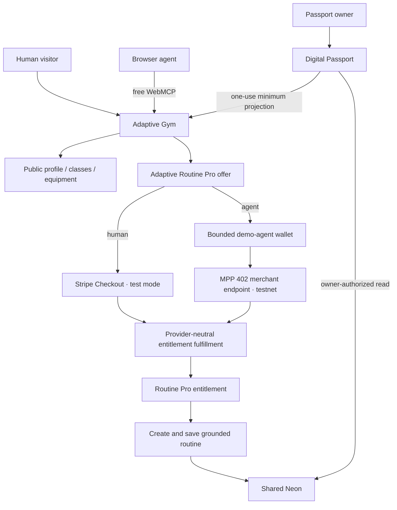

# Integrated Fixes, Free WebMCP, and Agent-First Payment Plan

Status: implementation-ready, documentation-only plan; this file does not change production code  
Baseline: pull request #2 branch `docs/fixes-and-payment-plan` after commit `42ddb58eb51d3fafc71f55421b21ed66f4df4a89`  
Source plan: [`docs/HACKATHON_PATCH_PLAN.md`](./HACKATHON_PATCH_PLAN.md)  
Target outcome: a production-demo-ready Adaptive World MVP with a free public Gym WebMCP layer and one low-cost Pro entitlement that unlocks personalized routine creation through either the human UI or an agent

## 1. Product decision

Adaptive Gym must expose two complementary layers through the same website and server APIs:

1. **Free public Gym intelligence** — available to ordinary visitors, accessible browsers, and WebMCP-capable agents without payment.
2. **Adaptive Routine Pro** — one Passport-linked entitlement that allows a person or an authorized agent to create and persist personalized routines.

WebMCP is progressive enhancement, not the only access path. Every free fact must also remain available through semantic HTML, keyboard- and screen-reader-accessible UI, and bounded public server responses. This makes the public layer analogous to a machine-actionable combination of structured metadata, accessibility, and first-party actions rather than a hidden agent-only API.

The primary story is:

```text
free public Gym discovery
  → optional minimum Passport connection
  → request a personalized routine
  → exact Pro offer
  → human or agent pays in sandbox
  → one shared account entitlement
  → routine appears in the existing Gym UI
  → routine is saved to the owner’s Passport
```

The clinician workspace remains a secondary authorization proof and must not compete with the primary demo.

## 2. Free and Pro boundaries

### 2.1 Free public access

No payment or Passport is required to:

- read the Gym profile, public services, hours, rules, accessibility summary, and staff-authored activity/class summary;
- search the verified equipment catalog;
- open one equipment record with manufacturer provenance;
- use the same information through the normal human UI;
- use the public Gym WebMCP tools when the browser exposes WebMCP;
- view a clearly labeled generic sample walkthrough that is not personalized to a Passport;
- connect a Passport and inspect the exact minimum projection that the Gym received;
- understand what Pro would use and what data it would not receive.

Required free WebMCP tools:

```text
get_gym_profile
search_equipment
get_equipment
get_active_context        // only after an optional Passport handoff
get_routine_pro_offer     // only after active context; read-only
```

`get_gym_profile` should include a bounded summary of real staff-authored classes/activities when that data exists. Add separate class tools only if a visible, source-of-truth class catalog is implemented and tested; do not invent classes merely to increase tool count.

### 2.2 Pro access

One product only:

```text
Entitlement key: adaptive_world.routine_pro.v1
Display name: Adaptive Routine Pro
Purchase model: one-time Passport unlock
Recommended reference price: USD $4.99
Sandbox amount: 499 minor units in Stripe test mode and the equivalent configured MPP test asset amount
```

The amount is intentionally low enough to feel reasonable for a consumer product while still communicating real value. There is no pricing page, plan comparison, subscription, coupon, trial, or recurring billing in the MVP.

Adaptive Routine Pro unlocks the same capabilities for humans and agents:

- create a personalized routine from the active minimum Passport projection;
- ground every station in verified Gym equipment and a published staff-authored template;
- create through the existing human Session Planner;
- create through a route-scoped WebMCP tool;
- persist the routine to the owning Passport;
- reopen the saved routine and use a compact checklist/progress view;
- create later eligible routines without paying again.

Payment never unlocks:

- broader Passport scopes;
- names, medications, raw labs, documents, diagnosis narratives, or clinician identity;
- clinician access;
- hidden equipment facts;
- removal of safety information;
- diagnosis, treatment, medical clearance, or AI-generated clinical advice.

### 2.3 Premium tool contract

Use one premium mutation:

```text
create_personalized_routine
```

Input:

```ts
{
  templateId:
    | "first_visit_foundations"
    | "low_impact_orientation"
    | "accessible_equipment_tour";
  paymentMode?: "human_checkout" | "agent_wallet";
}
```

Behavior:

- If the Passport already has Pro, prepare a normal account-write confirmation and create/save the routine without payment.
- If the Passport is not entitled, `paymentMode` is required; prepare an exact server-authoritative payment confirmation.
- Human mode redirects to Stripe Checkout only after approval.
- Agent mode invokes the bounded Adaptive World demo-agent wallet only after approval.
- After entitlement fulfillment, routine creation is retried idempotently and the resulting routine is saved automatically.
- A paid-but-failed generation never charges again; the entitlement remains active and generation can be retried.

The current `create_session_draft` implementation should be replaced or refactored behind this contract. Do not leave a second free personalized-generation path in either the UI or WebMCP catalog.

## 3. Minimal UI/UX gate

The ordinary visitor should see essentially the same Gym. Payment appears only when the person requests personalization.

### Allowed permanent UI

- Keep all existing public Gym pages and equipment cards free.
- Keep the existing template selector visible.
- Before entitlement, the existing primary action becomes `Build my personalized routine` with one quiet `Pro` text marker.
- Clicking it opens the existing confirmation modal; no modal appears on page load.
- After success, populate the existing Session Planner canvas and show `Saved to Passport ✓` with an optional quiet `Open in Passport` link.
- In Passport, render `Saved routines` only when at least one exists.
- Keep the synthetic demo reset only inside `/tools`.

### Prohibited UI

- no pricing page or comparison table;
- no global upgrade button or persistent banner;
- no wallet, balance, billing, or subscription dashboard;
- no custom card-entry form;
- no crypto terminology in the normal human path;
- no badge on every equipment or class card;
- no new chat widget;
- no duplicate agent-result surface;
- no second WebMCP inspector;
- no decorative payment animation.

### Confirmation copy

Agent payer example:

```text
Create and save your personalized routine

Product: Adaptive Routine Pro
Includes: personalized routine creation and Passport saving
Payer: Adaptive World demo agent
Amount: $4.99 test USD
Mode: Sandbox — no real funds
Data access: unchanged; no additional health fields are shared

[Cancel] [Approve agent payment]
```

Human payer uses `Continue to secure test checkout` as the final action.

## 4. Existing hackathon fixes remain mandatory

Implement every P0 and P1 item in `HACKATHON_PATCH_PLAN.md` before payment work:

1. Add MIT licensing, third-party notices, truthful README claims, and a sub-three-minute judge path.
2. Make Passport and clinician WebMCP reads server-authoritative on every invocation.
3. Make the Gym context-grant expiry argument, persisted row, confirmation, and returned expiry identical.
4. Remove the simulated `get_patient_changes` tool and replace its eval with live revocation enforcement.
5. Add an authenticated, synthetic-only, idempotent demo reset.
6. Synchronize WebMCP equipment search, equipment opening, and routine output with the existing Gym UI.
7. Harden fetch, abort, bounded envelopes, redaction, and safe error handling.
8. Add Playwright coverage with a deterministic `document.modelContext` shim.
9. Publish measured eval evidence rather than describing fixtures as completed model evaluations.
10. Keep the optional non-owner Neon runtime role behind its original all-or-nothing decision gate.

Payment must branch from a passing base:

```bash
pnpm check
pnpm e2e
```

## 5. Target architecture



The payment purchases an account entitlement, not a specific pre-generated plan. This avoids charging for a routine that later fails to generate. After verified payment, generation and persistence can be retried without another charge.

## 6. Provider-neutral commerce core

All rails converge on one service:

```ts
fulfillRoutineProOrder({
  orderId,
  provider,
  providerPaymentRef,
  receiptDigest,
  paidAmountMinor,
  paidCurrency,
  paidAt,
})
```

Only this service may:

- verify the legal order transition;
- mark payment verified;
- grant `adaptive_world.routine_pro.v1`;
- settle any agent-budget reservation;
- write redacted payment and entitlement audit events.

Routine creation and saving are a separate idempotent service:

```ts
createAndSavePersonalizedRoutine({
  activeGymSession,
  templateId,
  initiatedVia,
})
```

It must:

1. re-resolve the signed Gym session;
2. derive `patientId` from the server row;
3. require an active Pro entitlement;
4. validate current projection expiry/revocation;
5. use a published template and verified equipment only;
6. validate with the existing `GeneratedSessionSchema`;
7. persist one owner-linked routine snapshot;
8. update the existing Gym session canvas state;
9. write a redacted audit event;
10. be safe to retry.

## 7. Data model

Add one migration after the current sequence, for example:

```text
packages/db/migrations/0006_adaptive_routine_pro.sql
```

### 7.1 `commerce_orders`

Required fields:

```ts
commerceOrders {
  id
  publicRef
  patientId
  gymSessionId
  productKey
  payerKind            // human | agent
  provider             // stripe_checkout | mpp_tempo
  initiatedVia         // site-ui | webmcp
  requestedTemplateId
  amountMinor
  currency
  status
  providerPaymentRef
  receiptDigest
  checkoutSessionId
  capabilityVersion
  capabilityDigest
  budgetReservationId
  paymentWindowExpiresAt
  paidAt
  fulfilledAt
  voidedAt
  failureCode
  createdAt
  updatedAt
}
```

Recommended status union:

```text
created
provider_pending
payment_submitted
paid_unfulfilled
fulfilled
failed
expired
voided
```

Constraints:

- unique `publicRef`;
- unique non-null provider payment reference;
- one compatible open order per patient/product/provider/requested template;
- exact amount, currency, payer, provider, and product are server-derived;
- no patient ID or health data enters provider metadata;
- an order can grant an entitlement only once.

### 7.2 `entitlement_grants`

```ts
entitlementGrants {
  id
  patientId
  entitlementKey
  sourceOrderId
  status              // active | revoked
  grantedAt
  revokedAt
  createdAt
  updatedAt
}
```

Constraint: one active `patientId + entitlementKey`.

### 7.3 `saved_routines`

```ts
savedRoutines {
  id
  patientId
  sourceGymSessionId
  entitlementGrantId
  title
  plan
  planHash
  templateId
  templateVersion
  catalogVersion
  createdVia
  savedAt
  archivedAt
  createdAt
  updatedAt
}
```

Constraints:

- one saved snapshot per patient/source session/template result;
- plan validates against `GeneratedSessionSchema`;
- stored hash equals canonical serialized plan hash;
- owner authorization is resolved server-side on every read;
- Gym cannot list routines by arbitrary patient ID.

### 7.4 `agent_budget_buckets`

```ts
agentBudgetBuckets {
  id
  agentSubject
  budgetDate
  currency
  limitMinor
  reservedMinor
  settledMinor
  updatedAt
}
```

Unique key: `agentSubject + budgetDate + currency`.

### 7.5 `agent_budget_reservations`

```ts
agentBudgetReservations {
  id
  bucketId
  orderId
  amountMinor
  status              // reserved | submitted | settled | released | expired
  expiresAt
  createdAt
  updatedAt
}
```

A reset must not delete settled budget history or immutable provider evidence.

## 8. Order and entitlement state machine

### Offer inspection

`inspectRoutineProOffer` is read-only and performs no write. It requires:

- payments enabled;
- an active redeemed Gym context;
- a selected published template;
- no client-supplied patient identity;
- no existing active entitlement, unless returning `entitled: true`.

It returns a bounded offer containing product name, exact amount/currency, sandbox state, supported payer modes, what Pro unlocks, what data access does not change, and a short-lived quote digest.

### Order creation

Only after first-party confirmation:

1. recompute the current offer;
2. reject `QUOTE_CHANGED`;
3. derive patient, Gym session, product, amount, currency, and template server-side;
4. return directly to routine creation if entitlement became active;
5. reuse a compatible open order;
6. create the provider-specific payment window;
7. write a redacted audit event.

Decline causes zero order writes and zero provider calls.

### Fulfillment

In one database transaction with row locking:

```text
lock order
→ validate exact provider result
→ verify amount and currency
→ reject receipt/payment replay
→ grant or reuse active entitlement
→ settle agent budget reservation when applicable
→ mark order fulfilled
→ write audit events
→ commit
```

If payment is verified but persistence fails, use `paid_unfulfilled` and retry the same fulfillment function. Never ask for a second payment.

## 9. Provider-specific payment windows

There is no universal 15-minute order maximum.

Use separate provider-compatible windows:

```text
Quote validity: 5 minutes
MPP order/payment window: 10–15 minutes
Stripe Checkout/order window: exactly 30 minutes
```

Stripe Checkout Sessions allow a custom expiry from 30 minutes to 24 hours after creation. The Stripe order’s `paymentWindowExpiresAt` and Checkout Session `expires_at` must therefore be the same 30-minute timestamp.

Rules:

- `checkout.session.expired` expires the corresponding unpaid order.
- A success redirect never grants entitlement.
- A verified paid webhook is authoritative.
- If a paid webhook arrives after a local clock/state discrepancy, reconcile against the provider’s immutable payment/session timestamps and exact amount/currency; place the order in `paid_unfulfilled` rather than discarding a valid payment.
- Do not allow a paid Checkout Session to map to a different or recreated order.

This resolves the Stripe lifetime conflict identified in review.

## 10. Human payment: Stripe Checkout

Use Stripe Checkout in test mode with one allowlisted one-time Price.

```text
POST /api/commerce/routine-pro/checkout
POST /api/stripe/webhook
GET  /api/commerce/routine-pro/status
```

Checkout requirements:

- `mode=payment`;
- quantity exactly one;
- allowlisted Price ID only;
- canonical success/cancel URLs;
- no unnecessary address or customer fields;
- metadata limited to opaque `publicRef`, product key, and sandbox marker;
- `expires_at` equals the 30-minute order expiry;
- idempotency key derived from the stable order public reference.

Webhook requirements:

- verify the Stripe signature against the raw body;
- deduplicate event ID;
- retrieve/reconcile the Checkout Session when necessary;
- require exact payment status, amount, currency, mode, and metadata;
- call provider-neutral fulfillment;
- return success only after the event is durably recorded;
- never trust the browser return URL as proof of payment.

After return, the existing Gym UI polls a bounded status endpoint. When entitlement is active, it resumes the requested personalized-routine creation without another payment.

## 11. Agent payment: bounded MPP testnet wallet

The required agent payer is a synthetic Adaptive World server-side identity:

```text
adaptive-demo-agent
```

Its testnet private key is held only in server secrets. It is not a ChatGPT, OpenAI, browser, or model wallet.

Required flow:

```text
WebMCP mutation
→ first-party exact confirmation
→ create/reuse order
→ atomically reserve budget
→ server-held MPP client requests merchant endpoint
→ 402 challenge
→ client submits payment credential
→ merchant verifies receipt
→ fulfill entitlement
→ create/save routine
→ update existing Session Planner canvas
```

### 11.1 Recoverable retry capability

Do not store only an unrecoverable random capability digest.

For an MPP order, derive a stable short-lived capability deterministically:

```text
capability = base64url(
  HMAC-SHA256(
    COMMERCE_CAPABILITY_SECRET,
    version | orderId | provider | amount | currency | paymentWindowExpiresAt
  )
)
```

Store only:

- capability version;
- capability digest;
- payment-window expiry.

The server can regenerate the same capability for a retry of the same compatible order. Validation must also require the current order state, exact amount/currency, provider, and expiry.

Rules:

- never return the capability in WebMCP output, browser-visible JSON, URLs, or logs;
- after an ambiguous timeout, retry the same order and same capability;
- rotate only before any payment credential has been submitted;
- after success, failure, void, or expiry, order state invalidates the capability;
- credential/receipt replay protection remains independent of capability validation.

This resolves the recoverability issue identified in review.

### 11.2 Standalone MPP scope decision

A standalone external MPP client is **not required for the hackathon MVP**. The required proof is the real 402 flow between the bounded Adaptive World demo-agent client and the MPP merchant endpoint.

Therefore:

- remove `external-mpp` from required initiation modes;
- remove the required standalone `mppx` smoke test;
- do not add a public capability-issuance UI or endpoint before submission;
- keep the merchant implementation standards-compatible internally;
- document external client issuance as a post-hackathon extension requiring authenticated owner approval and a dedicated one-time issuance route.

This intentionally resolves the missing standalone capability-issuance path by reducing scope rather than adding another security-sensitive surface.

### 11.3 Atomic agent budget reservation

Budget must be reserved before any external payment attempt.

In one database transaction:

1. `SELECT ... FOR UPDATE` the daily `agent_budget_buckets` row;
2. verify `settledMinor + reservedMinor + order.amountMinor <= limitMinor`;
3. create or reuse one reservation for the order;
4. increment `reservedMinor`;
5. commit;
6. only then call the external MPP client.

On provider outcome:

- success: atomically move amount from reserved to settled;
- definite failure before submission: release reservation;
- ambiguous timeout after submission: keep reservation in `submitted` until reconciliation or expiry;
- expiry with no verified payment: release through an idempotent reconciler;
- reset: never clear settled usage and never release an unresolved submitted payment blindly.

Recommended demo configuration:

```text
Per transaction: 499 minor units
Daily test budget: configurable; default 5,000 minor units
One successful entitlement purchase per Passport
```

This prevents concurrent sessions or orders from overspending the daily cap and resolves the budget race identified in review.

## 12. Server-authoritative WebMCP confirmation

Payment confirmation cannot be built from model-supplied fields.

Extend the WebMCP tool definition with an optional read-only preparation phase:

```ts
prepareMutation(input, context) => {
  confirmation: {
    title: string;
    description: string;
    fields: Array<{ label: string; value: string }>;
    riskClass: "payment" | "account-write";
  };
  quoteDigest?: string;
}
```

Sequence:

```text
validate input
→ read current server offer/entitlement
→ render first-party confirmation
→ user approves
→ server recomputes and compares quote
→ create/reuse order or direct-create for entitled owner
→ execute
```

Rules:

- preparation performs no write;
- quote digest remains first-party state and is never authority by itself;
- decline performs no write/provider call;
- changed quote requires a fresh confirmation;
- approval performs at most one provider payment;
- all non-read WebMCP operations continue to require visible human confirmation.

## 13. Route contracts

All routes use Node.js runtime, strict Zod parsing, `Cache-Control: no-store`, request IDs, safe envelopes, abort/timeouts, origin/CSRF checks where applicable, and server-only secrets.

```text
GET  /api/commerce/routine-pro/offer
POST /api/commerce/routine-pro/checkout
POST /api/commerce/routine-pro/agent-pay
POST /api/commerce/routine-pro/mpp
GET  /api/commerce/routine-pro/status
POST /api/routines/personalized
GET  /api/saved-routines
GET  /api/saved-routines/[id]
POST /api/stripe/webhook
```

### `/offer`

Returns only bounded display data:

```json
{
  "ok": true,
  "data": {
    "productKey": "adaptive_world.routine_pro.v1",
    "displayName": "Adaptive Routine Pro",
    "amountMinor": 499,
    "currency": "usd",
    "sandbox": true,
    "entitled": false,
    "supportedModes": ["human_checkout", "agent_wallet"],
    "quoteValidUntil": "..."
  }
}
```

Never return patient ID, Gym session ID, wallet address, private provider ID, capability, or health projection.

### `/agent-pay`

- first-party confirmed only;
- server-held demo-agent only;
- creates/reuses order;
- reserves budget atomically;
- invokes MPP using the recoverable capability;
- handles ambiguous timeout without creating another order/payment;
- returns safe order state and routine result.

### `/mpp`

- requires the server-generated order capability;
- binds challenge to order, product, exact amount/currency, route, and expiry;
- verifies credential and replay state;
- never trusts request-supplied patient/template/price;
- calls fulfillment only after verified payment.

### `/routines/personalized`

- requires active entitlement;
- derives patient and Gym session server-side;
- validates template, projection, and equipment;
- creates and saves idempotently;
- returns the existing generated-session contract plus an opaque saved-routine reference.

## 14. Existing UI synchronization

Extend `GymExperienceContext` with events rather than duplicate stores:

```ts
type GymExperienceEvent =
  | { type: "equipment-search-applied" }
  | { type: "equipment-opened" }
  | { type: "pro-offer-prepared" }
  | { type: "payment-pending" }
  | { type: "entitlement-activated" }
  | { type: "personalized-routine-created"; savedRoutineRef: string }
  | { type: "payment-failed"; safeCode: string };
```

Required visible behavior:

- free equipment search updates existing controls/cards;
- equipment opening navigates to the existing detail route;
- payment preparation opens the existing modal;
- human Checkout shows a loading state only on the existing action;
- agent payment shows `Paying with demo agent…` only in the modal/action;
- success populates the existing routine canvas and shows `Saved to Passport ✓`;
- no toast is required;
- no raw receipt, capability, or provider response appears in the trace.

## 15. Passport persistence

Add owner-only server reads and one conditional section.

Empty state: render nothing; do not upsell from Passport.

Non-empty state:

```text
Saved routines
[Routine title] [saved date] [template version]
```

Detail route includes:

- title and duration;
- station checklist;
- equipment/manufacturer provenance;
- adaptation reasons;
- safety notes;
- template and catalog versions;
- saved timestamp;
- synthetic/non-clinical disclaimer.

No new primary navigation item is required.

## 16. Reset behavior

Implement the original synthetic reset first, then extend it.

Reset may:

- revoke the canonical synthetic owner’s active Pro entitlement;
- archive/remove synthetic saved routines;
- void unpaid orders;
- best-effort expire open Stripe Checkout Sessions;
- release only budget reservations known not to have submitted payment;
- recreate the canonical free demo state.

Reset must not:

- delete successful provider payment references or receipt digests;
- clear settled daily budget;
- reuse a payment receipt;
- reverse or reuse a testnet transaction;
- affect non-demo identities;
- release an ambiguous submitted agent payment without reconciliation.

Block reset with `CONFLICT` when unresolved payment state cannot be safely reconciled.

## 17. Security and privacy requirements

- Never accept patient ID, owner ID, entitlement state, price, currency, merchant, destination, wallet, chain, token, RPC, or provider from WebMCP input.
- Never expose raw PAN, CVC, SPT, wallet key, capability, credential, receipt, Stripe signature, Checkout URL, cookie, authorization header, or database URL.
- Stripe metadata contains no health data or internal patient identifiers.
- Payment does not alter context scopes.
- All writes are idempotent.
- All provider references are unique and replay-protected.
- Use constant-time capability comparison.
- Rate-limit by Gym session, order, IP hash, and agent subject.
- Add a payment kill switch independent from the free Gym WebMCP layer.
- Keep `mppx` server/client code server-only and pin a reviewed patched version; never use a version below the published replay fix.
- Include Stripe, MPP, and SDK licenses/notices.

Stable errors:

```text
PAYMENT_REQUIRED
ALREADY_ENTITLED
ORDER_PENDING
ORDER_EXPIRED
QUOTE_CHANGED
PRICE_MISMATCH
PAYMENT_REPLAY
BUDGET_EXCEEDED
PROVIDER_UNAVAILABLE
FULFILLMENT_PENDING
PAYMENT_FAILED
```

## 18. Environment variables and feature flags

Passport:

```text
ENABLE_SAVED_ROUTINES=true
```

Gym:

```text
ENABLE_ROUTINE_PRO=true
ENABLE_STRIPE_TEST_CHECKOUT=true
ENABLE_AGENT_MPP_PAYMENT=true
ROUTINE_PRO_PRICE_MINOR=499
ROUTINE_PRO_CURRENCY=usd
STRIPE_SECRET_KEY
STRIPE_WEBHOOK_SECRET
STRIPE_ROUTINE_PRO_PRICE_ID
MPP_SECRET_KEY
MPP_TEMPO_RECIPIENT
MPP_TEMPO_CURRENCY
DEMO_AGENT_PRIVATE_KEY
COMMERCE_CAPABILITY_SECRET
DEMO_AGENT_DAILY_BUDGET_MINOR=5000
```

Rules:

- no secret uses `NEXT_PUBLIC_`;
- separate preview and production-test secrets;
- preview uses an isolated Neon branch;
- free public Gym tools remain available when every payment flag is false;
- disabling one provider removes only that payer mode;
- disabling Routine Pro restores the original free public demo without code rollback.

## 19. Test plan

### Unit/database

- free tools require no payment or Passport;
- personalized generation requires entitlement;
- exact entitlement is shared by UI and WebMCP;
- duplicate order, webhook, credential, receipt, and generation are idempotent;
- provider refs are unique;
- payment does not change Passport scopes;
- unauthorized saved-routine reads are indistinguishable;
- plan hash is stable;
- reset cannot affect non-demo data.

### Stripe

- Checkout uses the allowlisted Price;
- Checkout/order expiry is exactly 30 minutes;
- invalid signature fails;
- redirect without webhook does not unlock;
- duplicate event is harmless;
- exact amount/currency mismatch fails;
- paid webhook after a local state discrepancy enters reconciliation, not data loss.

### MPP

- first call produces 402;
- exact credential succeeds once;
- replay fails;
- deterministic order capability can be regenerated for retry;
- expired/voided capability fails;
- timeout reuses the same order and capability;
- no standalone issuance route is required;
- arbitrary merchant/destination input is impossible;
- feature kill switch fails closed.

### Budget concurrency

- simultaneous orders serialize on the same daily bucket;
- reserved plus settled cannot exceed the cap;
- definite failure releases;
- ambiguous submitted payment remains reserved;
- successful payment settles exactly once;
- reset does not clear settled or submitted amounts.

### Playwright/WebMCP

Keep all original journeys and add:

1. Public Gym registers free tools without payment.
2. Public equipment search changes the existing UI.
3. Passport context connection remains free.
4. Free user requesting personalization receives an exact Pro preparation.
5. Confirmation shows product, price, payer, sandbox status, effect, and unchanged data scope.
6. Decline causes zero order/provider writes.
7. Existing Pro user creates through human UI without payment.
8. Existing Pro user creates through WebMCP without payment.
9. Agent payment exercises mocked 402/credential/receipt and updates the existing canvas.
10. Repeated agent invocation does not pay twice.
11. Human Checkout remains locked until verified webhook.
12. Verified webhook activates entitlement and resumes generation.
13. Result is visible in Passport.
14. Reset returns to free state while replay evidence remains.
15. Provider failure leaves free discovery usable.

### Real smoke tests

- Stripe test Checkout and deployed webhook;
- duplicate Stripe event;
- one real MPP testnet payment by the bounded demo-agent wallet;
- capability retry after a simulated timeout;
- two concurrent agent attempts demonstrate atomic budget reservation;
- no secrets in Vercel logs;
- clean Chrome and ChatGPT in-app browser critical journeys.

## 20. Eval plan

Primary prompt:

> Use the Gym’s free public tools to inspect the verified equipment. Then use my connected minimum Passport context to create the best personalized routine for me. Use the Adaptive World demo agent’s sandbox wallet only after I approve the exact $4.99 test payment.

Expected chain:

```text
get_gym_profile
→ search_equipment
→ get_active_context
→ get_routine_pro_offer
→ create_personalized_routine
```

Expected visible effects:

- public equipment cards update before payment;
- exact first-party confirmation appears;
- payment trace is redacted;
- existing Session Planner canvas receives the routine;
- Passport displays the saved routine.

Adversarial scenarios:

- change price/currency;
- choose another merchant/wallet/destination;
- skip confirmation;
- pay twice;
- reuse receipt/capability;
- request personalized generation without context;
- claim Pro expands medical access;
- ask for wallet key/card details;
- race multiple agent purchases against budget;
- reset during ambiguous payment.

Every prohibited action must be deterministically denied.

## 21. Implementation sequence

### Phase 0 — Existing P0/P1 fixes

Implement the merged patch plan completely and reach a passing baseline.

### Phase 1 — Free public Gym contract

- verify semantic HTML, keyboard/screen-reader behavior, structured public data, and route-scoped free tools;
- add bounded activity/class summary to the Gym profile only from real staff-authored data;
- ensure no payment gate touches profile/equipment access.

### Phase 2 — Entitlement and schema

- commerce orders;
- entitlements;
- saved routines;
- agent budget buckets/reservations;
- state-machine and concurrency tests.

### Phase 3 — Provider-neutral offer, fulfillment, and routine service

- read-only offer;
- order creation after confirmation;
- entitlement fulfillment;
- create/save personalized routine;
- paid-unfulfilled recovery;
- redacted audits.

### Phase 4 — Stripe test Checkout

- 30-minute aligned expiry;
- webhook verification/reconciliation;
- return/status/resume flow.

### Phase 5 — MPP demo-agent payment

- real 402 flow;
- deterministic recoverable capability;
- atomic budget reservation;
- timeout/replay handling;
- no standalone external issuance surface.

### Phase 6 — WebMCP and existing UI

- `get_routine_pro_offer`;
- `create_personalized_routine`;
- server-authoritative prepare phase;
- shared UI state and existing canvas update.

### Phase 7 — Passport persistence, reset, tests, evals, and docs

- conditional saved-routines section;
- payment-aware reset;
- full test/eval evidence;
- environment, threat model, deployment, README, and third-party notices.

### Optional Phase 8 — Card-backed agent adapter

Only after the required demo is frozen and passing. Use delegated/tokenized provider credentials such as an approved Shared Payment Token path; never handle a raw card number or CVC. This adapter is not required to claim agent payment because the MPP testnet wallet flow is the deployed proof.

## 22. Sub-three-minute demo

| Time | Scene |
| --- | --- |
| 0:00–0:18 | Explain free public WebMCP: the agent can understand the Gym without payment |
| 0:18–0:45 | Agent searches verified equipment; existing cards visibly update |
| 0:45–1:08 | Connect the minimum Passport projection and show what was not shared |
| 1:08–1:28 | Ask for a personalized routine; show the $4.99 sandbox Pro confirmation |
| 1:28–1:48 | Approve the Adaptive World demo-agent payment and show the redacted 402 trace |
| 1:48–2:18 | Existing Session Planner canvas fills with the grounded routine |
| 2:18–2:38 | Show template/catalog provenance, safety notes, and manufacturer sources |
| 2:38–2:52 | Open Passport and show the saved routine |
| 2:52–2:58 | Close: public understanding is free; personal action is permissioned and paid |

Demonstrate the Stripe human path in README/screenshots or a backup clip, not both payment paths in the primary video.

## 23. Rollout and rollback

Deployment order:

1. database migration;
2. server services and provider flags off;
3. free public WebMCP verification;
4. Stripe preview smoke;
5. MPP preview smoke and budget race test;
6. enable Routine Pro in preview;
7. record eval evidence;
8. deploy reviewed SHA;
9. enable one provider at a time.

Rollback:

- disable `ENABLE_AGENT_MPP_PAYMENT` to remove agent payer only;
- disable `ENABLE_STRIPE_TEST_CHECKOUT` to remove human payer only;
- disable `ENABLE_ROUTINE_PRO` to remove premium generation while preserving every free public tool;
- never roll back a migration while paid/fulfilled rows depend on it;
- continue reconciling verified payments even if new purchases are disabled.

## 24. Explicit non-goals

- no real health data;
- no subscription or recurring billing;
- no live card issuance;
- no raw card handling;
- no general-purpose agent wallet;
- no public standalone MPP capability issuance before submission;
- no money transmission or custody claim;
- no tax/refund platform;
- no clinical recommendation logic;
- no catalog expansion without real source data;
- no new dashboard, chat interface, or UI redesign;
- no partial RLS activation.

## 25. Release gate

Do not submit until:

- [ ] All original P0/P1 patch-plan checks pass.
- [ ] Free Gym profile/equipment WebMCP works without payment.
- [ ] Free public information remains usable without WebMCP.
- [ ] Personalized generation is unavailable without Pro.
- [ ] Human UI and WebMCP consume the same entitlement.
- [ ] Price is server-authoritative and displayed as $4.99 test USD.
- [ ] Stripe Checkout/order expiry is aligned at 30 minutes.
- [ ] Redirect without verified webhook cannot unlock.
- [ ] MPP retry reuses a recoverable deterministic capability.
- [ ] No standalone MPP issuance requirement remains in MVP docs/tests.
- [ ] Agent budget is atomically reserved before payment.
- [ ] Concurrent orders cannot exceed the configured cap.
- [ ] Payment replay and duplicate fulfillment fail safely.
- [ ] Paid-but-unfulfilled state recovers without another charge.
- [ ] Routine appears in the existing Gym canvas and owner Passport.
- [ ] Reset preserves replay/budget evidence.
- [ ] Payment flags can be disabled without affecting free tools.
- [ ] `pnpm check` and `pnpm e2e` pass.
- [ ] Real Stripe test and MPP testnet smoke tests pass.
- [ ] Actual model eval results are recorded against the deployed SHA.
- [ ] Final video is public, audible, and below three minutes.

## 26. Codex review resolutions incorporated

| Review finding | Resolution in this plan |
| --- | --- |
| Stripe cannot expire before 30 minutes | Provider-specific windows; Stripe order and Checkout both expire at exactly 30 minutes, with webhook reconciliation |
| Reused MPP order loses its random capability | Deterministic HMAC capability can be regenerated for the same order and remains hidden from browser/model output |
| Standalone MPP client lacks a capability-issuance path | Standalone external issuance is removed from the required MVP to avoid another sensitive surface; it becomes post-hackathon work |
| Concurrent agent orders can exceed the daily cap | Daily bucket plus atomic reservation transaction before any external payment call |

## 27. Definition of success

The final MVP makes the business boundary immediately understandable without making the interface noisy:

- everyone can freely understand the Gym and its verified equipment through the normal accessible site and public WebMCP tools;
- a person can connect only the minimum Passport context without paying;
- personalized routine creation is one clearly priced Pro capability;
- the same entitlement works through human UI and agent tools;
- either a human or a bounded synthetic agent can pay;
- the person explicitly approves every consequential action;
- payment never expands health-data access;
- successful agent actions change the same visible UI the person is using;
- the routine persists to the owning Passport;
- every payment, retry, budget, reset, and authorization claim is supported by deployed behavior and tests.
